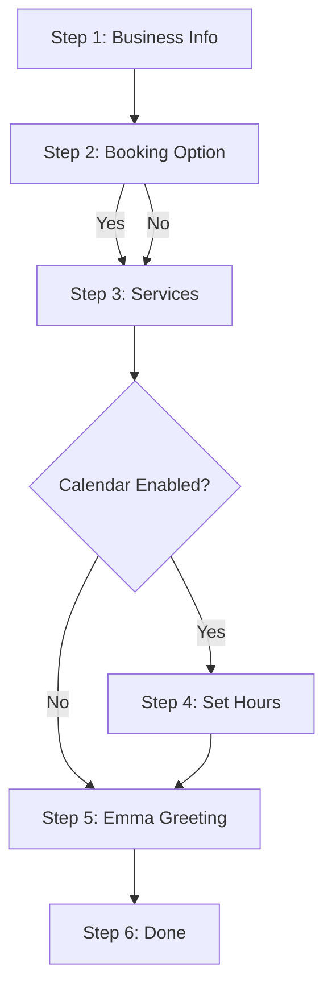

# Technical Specification: Calendar & Booking Opt-In System

This document specifies the design, database integration, routing conventions, user flows, and code changes required to implement a Calendar & Booking opt-in system for **Branch Live**.

---

## 1. Overview & Product Goal

Some service businesses (e.g., week-long renovation jobs, single large projects) do not need or want an online booking calendar. They only want Emma, the AI receptionist, to answer calls, answer questions using their knowledge base, and capture lead details.

Currently, public booking pages and booking links are active by default for all published websites. This specification introduces a `calendar_enabled` setting to make the calendar and booking wizard opt-in:
* **Default state**: New businesses default to receptionist-only (`calendar_enabled = 0`).
* **Existing state**: Existing businesses keep online booking enabled (`calendar_enabled = 1`) via a backfill migration.
* **Email & SMS links**: Booking links are never automatically included; they must be explicitly opted-in per message via a checkbox on the lead details screen.

---

## 2. Database Schema & Migration

We need to add a new column, `calendar_enabled`, to the `settings` table. 

### 2.1 Schema Definition (`settings` table)
* **Column**: `calendar_enabled`
* **Type**: `INTEGER`
* **Default**: `0` (Disabled / Receptionist-only)

### 2.2 Migration Implementation
The migration must be idempotent and run inside the [initDB](file:///C:/Users/17173/Projects/branchlive/worker.js#L1434) function in [worker.js](file:///C:/Users/17173/Projects/branchlive/worker.js).

To backfill existing businesses so they keep booking active, we check if the `ALTER TABLE` statement succeeds. If the table is altered (meaning the column was just added), we update all existing rows to `calendar_enabled = 1`. If the column already exists, the `ALTER TABLE` will fail and the backfill step is safely skipped, making it fully idempotent.

#### SQL & Javascript Code Location (in `initDB` ~line 1779):
```js
    // Migration: calendar_enabled flag. 0 = disabled (receptionist only), 1 = enabled (online booking).
    // Existing rows are backfilled to 1, while new signups default to 0.
    try {
      const alterResult = await env.DB.prepare('ALTER TABLE settings ADD COLUMN calendar_enabled INTEGER DEFAULT 0').run();
      // If alterResult succeeded without throwing, this is the first execution. Backfill existing.
      if (alterResult) {
        await env.DB.prepare('UPDATE settings SET calendar_enabled = 1').run();
      }
    } catch(e) {
      // Swallowed if column already exists
    }
```

---

## 3. Onboarding Flow Modifications

The onboarding wizard in [onboardingWizardHtmx](file:///C:/Users/17173/Projects/branchlive/worker.js#L11792) must expand from a 5-step wizard to a 6-step wizard to ask the business owner if they want online booking.



### 3.1 Wizard Steps Shift
1. **Step 1**: Business Info (unchanged)
2. **Step 2 (NEW)**: Online Booking Choice ("Do you want online booking?")
3. **Step 3**: Services (formerly Step 2)
4. **Step 4**: Set your hours (formerly Step 3, skipped if `calendar_enabled = 0`)
5. **Step 5**: Emma's greeting (formerly Step 4)
6. **Step 6**: Done (formerly Step 5)

### 3.2 HTML Render Updates in `onboardingWizardHtmx`
Inside the wizard HTML form:
* Change progress count text to: `Step X of 6`
* Set progress bars segment count to 6: `<span class="ob-seg cur"></span>... (total 6)`
* Insert the new Step 2 section:
```html
    <!-- Step 2 — Online Booking Choice -->
    <section class="ob-step" data-step="2">
      <h2>Do you want online booking?</h2>
      <p class="ob-desc">Let customers schedule appointments directly from your website or via links sent in follow-up messages.</p>
      <div class="ob-fields">
        <label style="display:flex;align-items:center;gap:12px;padding:16px;background:var(--bg-primary);border:1px solid var(--border-soft);border-radius:12px;cursor:pointer">
          <input type="radio" name="ob_calendar_choice" value="1" style="width:20px;height:20px;accent-color:var(--accent-amber)" checked>
          <div>
            <strong>Yes, enable online booking & calendar</strong>
            <div style="font-size:.85em;color:var(--text-muted);margin-top:2px">Allows online booking on your website and appointment invitations.</div>
          </div>
        </label>
        <label style="display:flex;align-items:center;gap:12px;padding:16px;background:var(--bg-primary);border:1px solid var(--border-soft);border-radius:12px;cursor:pointer;margin-top:10px">
          <input type="radio" name="ob_calendar_choice" value="0" style="width:20px;height:20px;accent-color:var(--accent-amber)">
          <div>
            <strong>No, receptionist-only</strong>
            <div style="font-size:.85em;color:var(--text-muted);margin-top:2px">Emma answers calls and logs leads, but online booking is disabled.</div>
          </div>
        </label>
      </div>
    </section>
```

### 3.3 Client-Side Controller updates (Wizard Script)
* Change `TOTAL = 6`.
* Configure step skipping in navigation helpers `obNext()`, `obBack()`, and `obSkip()`:
```javascript
  // Inside obNext() / proceed():
  if (step < TOTAL) {
    var nextStep = step + 1;
    // Step 4 is "Set Hours" - skip it if calendar is disabled
    if (nextStep === 4 && !state.calendar_enabled) {
      nextStep++;
    }
    showStep(nextStep);
    initStep(nextStep);
  }

  // Inside obBack():
  if (step > 1) {
    var prevStep = step - 1;
    if (prevStep === 4 && !state.calendar_enabled) {
      prevStep--;
    }
    showStep(prevStep);
    initStep(prevStep);
  }
```
* Update state collection for Step 2 and update `state.calendar_enabled`:
```javascript
  // Inside gatherStepData(n):
  if (n === 2) {
    var choice = document.querySelector('input[name="ob_calendar_choice"]:checked');
    var val = choice ? parseInt(choice.value, 10) : 0;
    state.calendar_enabled = (val === 1);
    return { calendar_enabled: val };
  }
```

### 3.4 Backend Save Updates in `handleOnboardingSave`
Shift step checks in [handleOnboardingSave](file:///C:/Users/17173/Projects/branchlive/worker.js#L11667):
* **Step 2 (Save)**: Persist `calendar_enabled` to settings.
```js
    if (step === 2) {
      const enabled = data.calendar_enabled === 1 ? 1 : 0;
      await env.DB.prepare(
        `INSERT INTO settings (user_id, calendar_enabled)
         VALUES (?, ?)
         ON CONFLICT(user_id) DO UPDATE SET calendar_enabled = excluded.calendar_enabled`
      ).bind(uid, enabled).run();
      return json({ ok: true, step });
    }
```
* **Step 3 (Services)**: (No changes except checking `step === 3` instead of `2`).
* **Step 4 (Calendar)**: (No changes except checking `step === 4` instead of `3`).
* **Step 5 (Greeting)**: (No changes except checking `step === 5` instead of `4`).
* **Step 6 (Done)**: (No changes except checking `step === 6` instead of `5`).

---

## 4. Lead Detail Page - Email Follow-Up Opt-In

Booking links must never be appended automatically to outbound emails. We provide a checkbox next to the "Send email" button on the lead detail page, which is visible only when the calendar is enabled and the site is published.

### 4.1 Data Resolution in `handleLeadDetailHtmx`
Query both the settings and site publish status alongside the lead:
```js
    const [lead, settings, site] = await Promise.all([
      env.DB.prepare('SELECT * FROM leads WHERE id = ? AND user_id = ?').bind(leadId, uid).first(),
      env.DB.prepare('SELECT calendar_enabled FROM settings WHERE user_id = ?').bind(uid).first(),
      env.DB.prepare('SELECT published, slug FROM sites WHERE user_id = ?').bind(uid).first(),
    ]);
    const showBookingLinkCheckbox = !!(settings && settings.calendar_enabled === 1 && site && site.published === 1);
```

### 4.2 Frontend Button Container Modification
Inside the HTML structure for `#lead-email-card` (~line 10303):
```html
      <div style="display:flex;gap:12px;align-items:center;margin-top:12px;flex-wrap:wrap">
        <button class="btn-amber btn-sm" id="lead-email-send" ${hasEmail ? '' : 'disabled style="opacity:.5;cursor:not-allowed"'} onclick="sendLeadEmailDraft(${lead.id})">📤 Send email</button>
        ${showBookingLinkCheckbox ? `
          <label style="display:inline-flex;align-items:center;gap:6px;font-size:0.85em;color:var(--text-muted);cursor:pointer">
            <input type="checkbox" id="email-add-booking-link" style="width:16px;height:16px;margin:0" onchange="toggleEmailBookingLink()"> Add booking link
          </label>
        ` : ''}
        <span id="lead-email-fb" class="lead-action-fb" aria-live="polite"></span>
      </div>
```

### 4.3 Client-Side Toggle Logic
Add a script function inside the inline `<script>` tag in [handleLeadDetailHtmx](file:///C:/Users/17173/Projects/branchlive/worker.js#L10214) to append/remove the booking URL from the textarea when the checkbox changes:
```javascript
function toggleEmailBookingLink() {
  var cb = document.getElementById('email-add-booking-link');
  var ta = document.getElementById('lead-email-body');
  if (!cb || !ta) return;
  var linkText = "\n\nYou can book an appointment online here: " + window.location.origin + "/s/${site.slug}/book";
  if (cb.checked) {
    if (!ta.value.includes(linkText)) {
      ta.value += linkText;
    }
  } else {
    ta.value = ta.value.replace(linkText, "");
  }
}
```

---

## 5. Lead Detail Page - SMS Follow-Up Preview Modal

To prevent automatic inclusion of the booking link in SMS replies, we display an SMS preview modal where the owner can toggle the booking link on or off prior to sending.

### 5.1 Modal Dialog HTML
Add a `<dialog>` element for the modal to the bottom of the lead details view in [handleLeadDetailHtmx](file:///C:/Users/17173/Projects/branchlive/worker.js#L10214):
```html
<dialog id="sms-preview-dialog" style="border:1px solid var(--border);border-radius:12px;background:var(--bg-card);color:var(--text-primary);padding:24px;max-width:440px;width:90%;box-shadow:0 10px 25px rgba(0,0,0,0.3)">
  <h3 style="margin-top:0;margin-bottom:12px">📱 Preview SMS Follow-up</h3>
  <div style="background:var(--bg-primary);border:1px solid var(--border);border-radius:8px;padding:12px;font-family:var(--font-mono);font-size:0.9em;margin-bottom:16px;white-space:pre-wrap;line-height:1.4" id="sms-preview-text"></div>
  
  ${showBookingLinkCheckbox ? `
    <label style="display:inline-flex;align-items:center;gap:6px;font-size:0.85em;color:var(--text-muted);cursor:pointer;margin-bottom:16px">
      <input type="checkbox" id="sms-add-booking-link" style="width:16px;height:16px;margin:0" onchange="updateSmsPreview()"> Add booking link
    </label>
  ` : ''}
  
  <div style="display:flex;justify-content:flex-end;gap:10px">
    <button class="btn btn-ghost btn-sm" onclick="document.getElementById('sms-preview-dialog').close()">Cancel</button>
    <button class="btn-amber btn-sm" id="sms-modal-send-btn" onclick="submitSmsFollowup(${lead.id})">Send Text</button>
  </div>
</dialog>
```

### 5.2 Client-Side Controller Update
Replace the existing `sendLeadFollowup` function and add support for the preview modal:
```javascript
// Triggers the preview dialog
async function sendLeadFollowup(kind, leadId) {
  if (kind !== 'sms') return;
  var dialog = document.getElementById('sms-preview-dialog');
  if (!dialog) return;

  var firstName = "${esc((lead.caller_name || '').split(' ')[0])}" || "there";
  var businessName = "${esc(settings.business_name || '')}";
  
  // Set the base message template (without booking link)
  window.smsBaseMsg = "Hi " + firstName + ", thanks for calling " + (businessName || "us") + "! We received your inquiry and will be in touch to get things scheduled. Reply STOP to opt out.";
  
  // Reset checkbox
  var cb = document.getElementById('sms-add-booking-link');
  if (cb) cb.checked = false;

  updateSmsPreview();
  dialog.showModal();
}

// Dynamically updates the preview text
function updateSmsPreview() {
  var cb = document.getElementById('sms-add-booking-link');
  var preview = document.getElementById('sms-preview-text');
  var msg = window.smsBaseMsg;
  if (cb && cb.checked) {
    var bookUrl = window.location.origin + "/s/${site.slug}/book";
    msg = msg.replace(" Reply STOP to opt out.", " Book online: " + bookUrl + " Reply STOP to opt out.");
  }
  preview.textContent = msg;
}

// Submits the finalized preview message payload to the server
async function submitSmsFollowup(leadId) {
  var dialog = document.getElementById('sms-preview-dialog');
  var fbId = 'lead-sms-fb';
  var btn = document.getElementById('sms-modal-send-btn');
  btn.disabled = true;
  btn.textContent = 'Sending…';
  
  try {
    var payload = {
      method: 'POST',
      credentials: 'same-origin',
      headers: { 'Content-Type': 'application/json' },
      body: JSON.stringify({ message: document.getElementById('sms-preview-text').textContent })
    };
    var r = await fetch('/api/leads/' + leadId + '/followup-sms-htmx', payload);
    var d = await r.json().catch(function(){ return {}; });
    dialog.close();
    if (d.ok) { setFb(fbId, true, 'text sent'); }
    else { setFb(fbId, false, d.error || 'Could not send text'); }
  } catch(e) {
    dialog.close();
    setFb(fbId, false, 'Connection error');
  } finally {
    btn.disabled = false;
    btn.textContent = 'Send Text';
  }
}
```

### 5.3 Backend API Change (`handleLeadFollowupSmsHtmx`)
Modify the SMS handler to read the custom message from the JSON payload if provided:
```js
async function handleLeadFollowupSmsHtmx(request, env, uid, leadId) {
  try {
    const lead = await env.DB.prepare('SELECT * FROM leads WHERE id = ? AND user_id = ?').bind(leadId, uid).first();
    if (!lead) return json({ ok: false, error: 'Lead not found' });
    if (!lead.caller_phone) return json({ ok: false, error: 'This lead has no phone number' });

    const body = await request.json().catch(() => ({}));
    const settings = await env.DB.prepare('SELECT business_name, forwarding_number FROM settings WHERE user_id = ?').bind(uid).first();
    const businessName = (settings && settings.business_name) || '';
    const firstName = (lead.caller_name || '').split(' ')[0];
    const nameLine = firstName ? `Hi ${firstName}, ` : 'Hi, ';

    // Default message does NOT contain the booking link (complying with opt-in-only requirement)
    const msg = body.message || `${nameLine}thanks for calling ${businessName || 'us'}! We received your inquiry and will be in touch to get things scheduled. Reply STOP to opt out.`;
    
    const sent = await sendSms(env, { to: lead.caller_phone, body: msg });
    if (!sent) return json({ ok: false, error: 'SMS could not be sent. Check Twilio configuration.' });
    return json({ ok: true });
  } catch (e) {
    console.error('Lead followup sms htmx error:', e);
    return json({ ok: false, error: 'Could not send SMS' });
  }
}
```

---

## 6. Public Booking Page Gating

If `calendar_enabled` is set to `0`, access to the booking page wizard at `/s/{slug}/book` is denied, rendering a dedicated "Booking not available" template instead.

### 6.1 Context Resolution update in `loadBookingContext`
Modify the query in [loadBookingContext](file:///C:/Users/17173/Projects/branchlive/worker.js#L7198) to pull `calendar_enabled`:
```sql
  SELECT business_name, working_hours, buffer_min, timezone, time_format, calendar_enabled 
  FROM settings 
  WHERE user_id = ?
```

### 6.2 Handler Gate in `handlePublicBookingPage`
Add a conditional block to return the booking not available page in [handlePublicBookingPage](file:///C:/Users/17173/Projects/branchlive/worker.js#L7237):
```javascript
    if (settings.calendar_enabled === 0) {
      return new Response(renderBookingNotAvailablePage(businessName), { headers: { 'Content-Type': 'text/html' } });
    }
```

### 6.3 Booking Not Available Template
Provide a styled template matching the booking page color palette:
```javascript
function renderBookingNotAvailablePage(businessName) {
  return `<!DOCTYPE html>
<html lang="en">
<head>
<meta charset="UTF-8">
<meta name="viewport" content="width=device-width,initial-scale=1">
<title>Booking Unavailable — ${htmxEsc(businessName)}</title>
<style>
  :root {
    --amber-100: #fef3c7;
    --amber-600: #d97706;
    --neutral-800: #1e293b;
    --bg-main: #fafaf9;
  }
  body {
    font-family: 'Inter', system-ui, sans-serif;
    background-color: var(--bg-main);
    color: var(--neutral-800);
    display: flex;
    align-items: center;
    justify-content: center;
    min-height: 100vh;
    margin: 0;
    padding: 24px;
  }
  .card {
    background: white;
    border-radius: 16px;
    border: 1px solid var(--amber-100);
    padding: 40px 32px;
    max-width: 480px;
    width: 100%;
    text-align: center;
    box-shadow: 0 4px 20px rgba(120, 53, 15, 0.05);
  }
  h1 {
    font-size: 1.5rem;
    margin-top: 0;
    margin-bottom: 12px;
  }
  p {
    color: #64748b;
    line-height: 1.6;
    margin-bottom: 24px;
    font-size: 0.95rem;
  }
</style>
</head>
<body>
  <div class="card">
    <div style="font-size: 3rem; margin-bottom: 16px">📅</div>
    <h1>Online Booking Unavailable</h1>
    <p>Online booking is currently not active for ${htmxEsc(businessName)}. Please call or contact us directly to schedule your appointment.</p>
  </div>
</body>
</html>`;
}
```

---

## 7. Public Website (`/s/{slug}`) Rendering Updates

When `calendar_enabled` is `0`, we hide the booking CTAs and booking section from the business's public website.

### 7.1 Site Shared HTML update in `siteSharedHtml`
Pass and verify the settings object:
```javascript
  const calendarEnabled = data.settings && data.settings.calendar_enabled === 1;
  const bookBtn = calendarEnabled ? `<a class="s-btn s-btn-book" href="${bookUrl}">📅 Book Appointment</a>` : '';
```

### 7.2 Template Section Guards
All template definitions ([tplModern](file:///C:/Users/17173/Projects/branchlive/worker.js#L6956), `tplWarmCraft`, `tplBoldImpact`, `tplSoftElegance`, `tplMinimalGrid`) must guard the `bookingSection` render with the `calendarEnabled` flag.

For example, in `tplModern`:
```javascript
  const calendarEnabled = data.settings && data.settings.calendar_enabled === 1;
  
  // Guard the section:
  const bookingSection = s('booking') && calendarEnabled
    ? `<section class="s-sec s-cta"><div class="s-wrap"><div class="s-kicker">Book</div><h2>Ready to book?</h2><p class="s-lede" style="margin:8px 0 18px">Pick a time that works for you.</p>${h.bookingInner}</div></section>` : '';
```
Apply the same `&& calendarEnabled` checks to the other templates' booking sections.

---

## 8. Settings Dashboard Updates

Add the `calendar_enabled` toggle and booking URL display under a new settings section.

### 8.1 Fetch Site Slug in `handleSettingsHtmx`
Modify [handleSettingsHtmx](file:///C:/Users/17173/Projects/branchlive/worker.js#L3642) to load the site slug and pass it to [settingsHtmxBody](file:///C:/Users/17173/Projects/branchlive/worker.js#L2966):
```javascript
    const [row, site] = await Promise.all([
      env.DB.prepare('SELECT * FROM settings WHERE user_id = ?').bind(uid).first(),
      env.DB.prepare('SELECT slug, published FROM sites WHERE user_id = ?').bind(uid).first(),
    ]);
    if (row && site) {
      row._slug = site.slug;
      row._site_published = site.published;
    }
```
*Note: Make sure to apply this same query resolution to BOTH the GET and POST paths in `handleSettingsHtmx`.*

### 8.2 Render Toggle UI in `settingsHtmxBody`
Insert the "Calendar & Booking" section in `settingsHtmxBody` form (above the submit button):
```html
    <div class="card" style="margin-top:16px">
      <h3 style="margin-top:0">Calendar & Booking${tip("Toggle online client booking and see your public booking link.")}</h3>
      ${check('calendar_enabled', 'Enable online booking & booking page', !!s.calendar_enabled)}
      ${s.calendar_enabled && s._slug && s._site_published ? `
        <div style="margin-top:12px;padding:12px;background:var(--bg-primary);border:1px solid var(--border-soft);border-radius:8px">
          <label style="display:block;font-size:.72rem;font-family:var(--font-mono);letter-spacing:.04em;color:var(--text-muted);margin-bottom:4px;text-transform:uppercase">Public Booking URL</label>
          <a class="mono" style="color:var(--accent-amber);font-size:.9em" href="/s/${htmxEsc(s._slug)}/book" target="_blank">/s/${htmxEsc(s._slug)}/book</a>
        </div>
      ` : ''}
    </div>
```

### 8.3 Persist Toggle on Settings Update
Include `calendar_enabled` in the settings UPSERT/UPDATE statements inside the POST handler in `handleSettingsHtmx`:
1. Add `calendar_enabled` to the insert column list.
2. Add `?` to the `VALUES` list.
3. Add `calendar_enabled = excluded.calendar_enabled` to the `ON CONFLICT` update list.
4. Bind `form.get('calendar_enabled') ? 1 : 0` at the end of the bind argument array.

---

## 9. Code Checklist & Verification

* [ ] Run `initDB` migration and verify that existing rows are set to `1` while default new rows are `0`.
* [ ] Complete Onboarding Wizard with "No" to online booking. Verify Step 4 (Hours) is skipped.
* [ ] Verify that booking CTAs are completely hidden from `/s/{slug}` when `calendar_enabled = 0`.
* [ ] Verify `/s/{slug}/book` displays the "Booking Unavailable" screen when `calendar_enabled = 0`.
* [ ] Verify the SMS preview modal launches when clicking "Send text" on the Lead Detail screen.
* [ ] Verify that toggling the booking link checkbox in SMS/Email details alters the message body only when checked.
