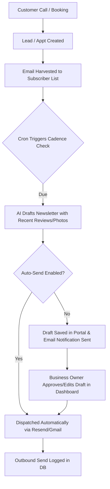
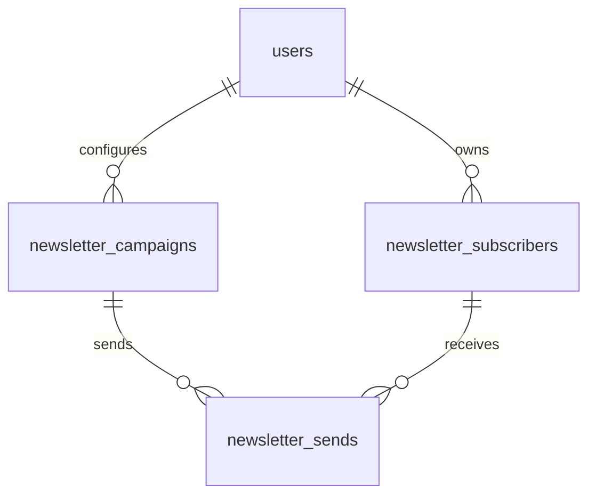

# Technical Specification: Email Newsletters

This document specifies the architecture, database schema, template system, scheduling engine, billing integration, and frontend components for the **Email Newsletters** feature (Feature #8) for **Branch Live**.

---

## 1. Overview & User Flow

The Email Newsletters feature allows local businesses on Branch Live to re-engage past customers automatically. Rather than requiring active campaign building, the system monitors business activity (e.g., new Google reviews, recent job photos, updated service listings) and uses AI to draft and send monthly, quarterly, or annual newsletters.

### Key Value Proposition
- **Hands-off Marketing**: AI auto-generates content blocks based on real business activity.
- **Flexible Cadence**: Supports monthly, quarterly, or annual schedules.
- **Custom Branding**: Emails are sent on behalf of the local business, utilizing their site's accent color and custom layouts, minimizing Branch Live branding.
- **Top-of-funnel Sync**: Automatically harvests customer emails from call logs, leads, and appointments.

### User Flow Diagram



---

## 2. Database Schema

To support newsletter campaigns, subscriber management, and delivery logs, three new tables will be added to the D1 database in `worker.js` (inside `initDB()`).



### 2.1 `newsletter_subscribers`
Tracks the audience list for each business. Every contact must belong to a specific business owner.

| Column | Type | Constraints | Description |
| :--- | :--- | :--- | :--- |
| `id` | INTEGER | PRIMARY KEY AUTOINCREMENT | Unique ID of the subscriber |
| `user_id` | INTEGER | REFERENCES users(id) | The business owner who owns this subscriber |
| `email` | TEXT | NOT NULL | Customer's email address |
| `name` | TEXT | NULL | Customer's name (for personalization) |
| `phone` | TEXT | NULL | Customer's phone number (optional) |
| `status` | TEXT | DEFAULT 'active' | Status: `'active'`, `'unsubscribed'`, `'bounced'` |
| `source` | TEXT | DEFAULT 'lead' | Source: `'lead'`, `'appointment'`, `'manual'` |
| `source_id` | INTEGER | NULL | Linked lead or appointment ID |
| `created_at` | TEXT | DEFAULT (datetime('now')) | Timestamp when added |
| `unsubscribed_at`| TEXT | NULL | Timestamp when unsubscribed |

> [!NOTE]
> An index `idx_news_sub_user_email` is created as `UNIQUE(user_id, email)` to prevent duplicate subscriptions under the same business.

### 2.2 `newsletter_campaigns`
Tracks the individual newsletter dispatches, their content, and dispatch state.

| Column | Type | Constraints | Description |
| :--- | :--- | :--- | :--- |
| `id` | INTEGER | PRIMARY KEY AUTOINCREMENT | Campaign ID |
| `user_id` | INTEGER | REFERENCES users(id) | The business owner |
| `title` | TEXT | NOT NULL | Internal name (e.g., "July 2026 Monthly Update") |
| `subject` | TEXT | NOT NULL | Email subject line |
| `content` | TEXT | NOT NULL | Newsletter HTML body |
| `status` | TEXT | DEFAULT 'draft' | Status: `'draft'`, `'queued'`, `'sending'`, `'completed'`, `'failed'` |
| `scheduled_for`| TEXT | NULL | Planned ISO timestamp for automated sending |
| `sent_at` | TEXT | NULL | Timestamp when actual dispatch finished |
| `recipients_count`| INTEGER | DEFAULT 0 | Count of targeted subscribers |
| `created_at` | TEXT | DEFAULT (datetime('now')) | Creation timestamp |

### 2.3 `newsletter_sends`
A granular delivery log to track delivery status for individual subscribers per campaign.

| Column | Type | Constraints | Description |
| :--- | :--- | :--- | :--- |
| `id` | INTEGER | PRIMARY KEY AUTOINCREMENT | Send log ID |
| `campaign_id` | INTEGER | REFERENCES newsletter_campaigns(id) | Linked campaign |
| `subscriber_id`| INTEGER | REFERENCES newsletter_subscribers(id) | Recipient subscriber |
| `status` | TEXT | DEFAULT 'pending' | Delivery status: `'pending'`, `'sent'`, `'failed'` |
| `resend_id` | TEXT | NULL | Response ID returned from the Resend API |
| `sent_at` | TEXT | NULL | Timestamp of actual transmission |

### 2.4 Auto-Harvesting Logic
To build subscriber lists without manual effort:
1. **Lead Captured**: When a new lead is saved in the `leads` table with a valid `caller_email`, the system runs:
   ```sql
   INSERT INTO newsletter_subscribers (user_id, email, name, phone, source, source_id)
   VALUES (?, ?, ?, ?, 'lead', ?)
   ON CONFLICT(user_id, email) DO UPDATE SET status = 'active' WHERE status = 'unsubscribed';
   ```
2. **Appointment Booked**: When an appointment is booked and the client provides an email, the system inserts/updates the subscriber database.

---

## 3. Template System & Content Blocks

Newsletters are generated using a modular layout that matches the theme of the business's website (e.g., Warm Craft, Modern, Bold Impact).

### 3.1 Custom Email Shell (`businessEmailShell`)
Unlike transactional emails, newsletters must be branded as the **local business**, not Branch Live. A new helper function, `businessEmailShell(content, settings, site)`, wraps newsletter campaigns:

```js
function businessEmailShell(content, settings, site) {
  const accent = site.accent || '#d4a574';
  const name = settings.business_name || settings.company;
  const phone = settings.forwarding_number || '';
  const instagram = settings.instagram_url || '';
  const facebook = settings.facebook_url || '';
  
  let socialLinks = '';
  if (facebook) socialLinks += `<a href="${facebook}" style="color:${accent};margin:0 10px;text-decoration:none;">Facebook</a>`;
  if (instagram) socialLinks += `<a href="${instagram}" style="color:${accent};margin:0 10px;text-decoration:none;">Instagram</a>`;

  return `<!DOCTYPE html>
<html>
<head><meta charset="UTF-8"><meta name="viewport" content="width=device-width, initial-scale=1.0"></head>
<body style="margin:0;padding:0;background-color:#fafaf9;color:#1e293b;font-family:'Inter',sans-serif;">
<table width="100%" cellpadding="0" cellspacing="0" style="background-color:#fafaf9;padding:20px 0;">
<tr><td align="center">
<table width="600" cellpadding="0" cellspacing="0" style="background-color:#ffffff;border-radius:12px;border:1px solid #e2e8f0;overflow:hidden;">
  <!-- Header -->
  <tr><td style="background-color:#1e1b4b;padding:24px;text-align:center;">
    <span style="color:#ffffff;font-size:22px;font-weight:700;letter-spacing:-0.5px;">${name}</span>
  </td></tr>
  <!-- Content Body -->
  <tr><td style="padding:40px 32px;">
    ${content}
  </td></tr>
  <!-- Footer -->
  <tr><td style="padding:24px 32px;background-color:#f8fafc;border-top:1px solid #e2e8f0;text-align:center;">
    <p style="color:#64748b;font-size:14px;margin:0 0 12px;">Questions? Call us at <span style="color:${accent};font-weight:600;">${phone}</span></p>
    <div style="margin-bottom:16px;">${socialLinks}</div>
    <p style="color:#94a3b8;font-size:12px;margin:0;">
      You received this because you are a customer of ${name}.<br>
      <a href="https://branchlive.com/s/${site.slug}/unsubscribe?email={{SUBSCRIBER_EMAIL}}&token={{UNSUB_TOKEN}}" style="color:#64748b;text-decoration:underline;">Unsubscribe</a>
    </p>
    <p style="color:#cbd5e1;font-size:10px;margin-top:14px;letter-spacing:0.5px;text-transform:uppercase;">Powered by Branch Live</p>
  </td></tr>
</table>
</td></tr>
</table>
</body>
</html>`;
}
```

### 3.2 AI Content Blocks
When the scheduling engine generates a newsletter, it queries the database for recent activity and populates several dynamic blocks:

1. **Testimonial Block (Social Proof)**:
   Extracts the highest-rated reviews received in the last period.
   ```sql
   SELECT author_name, rating, text FROM reviews 
   WHERE user_id = ? AND rating >= 4 
   ORDER BY reviewed_at DESC LIMIT 2;
   ```
2. **Recent Work Block (Visual Portfolio)**:
   Extracts recent project photos uploaded by the business.
   ```sql
   SELECT data, caption, type FROM photos 
   WHERE user_id = ? 
   ORDER BY created_at DESC LIMIT 2;
   ```
3. **Featured Service Block (Value Proposition)**:
   Promotes a key service offered by the business.
   ```sql
   SELECT item, price, notes FROM knowledge 
   WHERE user_id = ? AND category = 'Services' 
   ORDER BY RANDOM() LIMIT 1;
   ```
4. **Call to Action Block**:
   Renders a prominent, colored button linking to `/s/{slug}/book` so readers can instantly schedule their next service appointment.

---

## 4. Scheduling & Automated Generation

### 4.1 Frequency Cadence
The business configures their newsletter cadence in settings via the `newsletter_frequency` field (`'monthly'`, `'quarterly'`, or `'annual'`).

- **Monthly**: Runs every 30 days.
- **Quarterly**: Runs every 90 days.
- **Annual**: Runs every 365 days.

### 4.2 Auto-Drafting and Sending States
To give businesses control, the system operates in one of two modes:
- **Auto-Send Mode**: The AI automatically drafts and dispatches the newsletter on the due date. The business owner receives a summary email reporting how many customers were reached.
- **Manual Approval Mode**: The AI drafts the newsletter, schedules it as a `draft` inside `newsletter_campaigns`, and emails the business owner: *"Your newsletter draft is ready. Review and approve it in your dashboard."*

---

## 5. Email Delivery & Infrastructure

Newsletters leverage the existing `sendEmail()` function, which automatically detects if the business has a connected Google Account (`sendViaGmail`) or falls back to the platform's Resend key.

### 5.1 Recipient Tokenization & Unsubscribes
To comply with anti-spam regulations (CAN-SPAM / CASL):
- Every outgoing newsletter replaces `{{SUBSCRIBER_EMAIL}}` and `{{UNSUB_TOKEN}}` in the template with personalized values.
- The `UNSUB_TOKEN` is an HMAC-SHA256 hash of the subscriber's email and `user_id` signed by a system-level secret key:
  ```js
  const token = await hmacSha256(secretKey, `${userId}:${email}`);
  ```
- A public, unauthenticated route `GET /s/{slug}/unsubscribe` checks the validity of this token. If correct, it marks the subscriber status as `'unsubscribed'` and presents a styled success page.

### 5.2 Handling Batch Sending Limits
Cloudflare Workers impose a limit of 50 subrequests per single fetch request on the free plan, and execution limits can terminate long-running loops.
- To safely deliver newsletters to large customer lists:
  - Dispatches are processed in batches (e.g., 20 emails per tick).
  - Campaign status is set to `'sending'`.
  - The cron job processes the queue iteratively across multiple invocations, or utilizes a **Cloudflare Queue** consumer to dispatch concurrently without hitting limits.

---

## 6. Dashboard Interface (`/p/newsletters`)

A new, full-width management console is added at `/p/newsletters`, matching the high-fidelity HTMX and CSS architecture of Branch Live.

### 6.1 UI Mockup

```
+-------------------------------------------------------------------------------+
|  ⚡ Branch Live | Overview  Leads  Calendar  Blog  [Newsletters]  Billing     |
+-------------------------------------------------------------------------------+
|                                                                               |
|  Newsletters                                                                  |
|  Keep past customers engaged and booking.                                     |
|                                                                               |
|  +------------------------+  +------------------------+  +-----------------+  |
|  | Active Subscribers     |  | Cadence                |  | Total Sent      |  |
|  | 342                    |  | Monthly (Auto-Send)    |  | 1,368 emails    |  |
|  +------------------------+  +------------------------+  +-----------------+  |
|                                                                               |
|  [ Pending AI Draft ] -----------------------------------------------------   |
|  Subject: Summer maintenance tips from riverside Plumbing Co                  |
|  Scheduled Send: July 15, 2026                                               |
|                                                                               |
|  +---------------------------------------+ +--------------------------------+ |
|  | HTML Live Preview                     | | Edit Subject / Body            | |
|  |                                       | | Subject: [                     ] | |
|  | +-----------------------------------+ | | Body (Markdown):               | |
|  | | Riverside Plumbing Co             | | | [                              | |
|  | |                                   | | |  What's new this month...      | |
|  | | Hi [Name],                        | | |                                | |
|  | | We've had a busy month. Here is a | | |                                | |
|  | | project we completed...           | | | ]                              | |
|  | +-----------------------------------+ | +--------------------------------+ |
|  |                                       |                                    | |
|  | [ Send Test Email ]                   | [ Edit Content ]   [ Approve Now ] | |
|  +---------------------------------------+ ---------------------------------+ |
|                                                                               |
|  Campaign History                                                             |
|  +---------------------+-------------------+------------------+------------+  |
|  | Date                | Subject           | Recipients       | Status     |  |
|  +---------------------+-------------------+------------------+------------+  |
|  | Jun 1, 2026 09:00   | Spring Prep Tips  | 320              | Sent       |  |
|  | May 1, 2026 08:30   | We're Expanding   | 312              | Sent       |  |
|  +---------------------+-------------------+------------------+------------+  |
|                                                                               |
+-------------------------------------------------------------------------------+
```

### 6.2 HTMX Integration Details
- **Inline Editing**: Modifying the campaign draft uses `hx-post="/api/newsletters/save"` to autosave edits.
- **Approve and Send**: Clicking "Approve Now" triggers `hx-post="/api/newsletters/send-now"`, transitioning the draft to `queued` for immediate cron dispatch.
- **Subscriber Directory**: A search input updates the subscriber grid reactively using `hx-get="/p/newsletters/subscribers?q=..."` with a debounce of `300ms`.

---

## 7. Settings Page UI

The newsletter configuration is integrated into `/settings-htmx` under a new collapsible section titled **"Email Newsletters Add-on"**.

### Settings Fields
1. **Enable Newsletters Toggle**:
   Toggles `addon_newsletter` in settings. If the business has not subscribed to the add-on, it triggers the Stripe payment/checkout modal.
2. **Frequency Cadence**:
   Dropdown with values `monthly` (default), `quarterly`, `annual`.
3. **Approval Mode**:
   Radio buttons:
   - `Auto-Send`: *"Generate and send automatically without my intervention."*
   - `Draft & Notify`: *"Generate a draft and notify me. Hold sending until I review."*
4. **Test Delivery**:
   An input prefilled with the owner's email address and a button to trigger a test render of the current draft.

---

## 8. Coexistence with Email Autoresponder Add-on

It is critical to distinguish the newsletter service from the existing transactional email autoresponder.

| Attribute | Email Autoresponder (`addon_email`) | Email Newsletters (`addon_newsletter`) |
| :--- | :--- | :--- |
| **Pricing** | $9.95 / mo | $9.95 / mo (or Tiered: $9.99, $7.99, $5.99) |
| **Behavior** | **Reactive**: Instantly responds to an event (missed call, appointment booked). | **Proactive**: Regularly timed broadcast to keep the business top-of-mind. |
| **Audience** | Single recipient (the specific lead or client). | Full customer list (all historical leads and contacts). |
| **Trigger** | Immediate system event webhook / call handler. | Cron schedule checker (runs once daily at off-peak hours). |
| **Shared Code**| Uses `sendEmail()` and logs to `email_log`. | Uses `sendEmail()`, logs sends, and populates subscriber records. |

### Top-of-Funnel Integration Flow
```
[ Incoming Lead/Call ]
          │
          ▼
[ Email Autoresponder ] ──(Sends missed-call email instantly)
          │
          ▼ (Consent captured / Email parsed)
[ Newsletter Subscribers ] ──(Enrolled for monthly/quarterly newsletters)
```

---

## 9. Stripe Billing Integration

The Newsletter feature is billed as an optional add-on. 

### 9.1 Add-on Registry Addition (`worker.js` ~line 915)
We expand `ADDONS` configuration to include the newsletter add-on:

```js
const ADDONS = {
  website:    { column: 'addon_website',    label: 'Website Builder',      icon: '📱', price: 9.95, priceId: null },
  reviews:    { column: 'addon_reviews',    label: 'Review Monitoring',    icon: '⭐', price: 9.95, priceId: null },
  social:     { column: 'addon_social',     label: 'Social Media',         icon: '📣', price: 9.95, priceId: null },
  blog:       { column: 'addon_blog',       label: 'AI Blog Posts',        icon: '✍️', price: 14.95, priceId: null },
  email:      { column: 'addon_email',      label: 'Email Autoresponder',  icon: '✉️', price: 9.95, priceId: null },
  newsletter: { column: 'addon_newsletter', label: 'Email Newsletters',    icon: '📧', price: 9.95, priceId: null }, // Added
};
```
> [!TIP]
> To support tiered pricing ($9.99/mo monthly, $7.99/mo quarterly, $5.99/mo annual) dynamically from Stripe, the price in `ADDONS` can be updated dynamically when the user changes their cadence in settings, or mapped to multiple Price IDs: `STRIPE_PRICE_NEWSLETTER_MONTHLY`, `STRIPE_PRICE_NEWSLETTER_QUARTERLY`, `STRIPE_PRICE_NEWSLETTER_ANNUAL`.

### 9.2 Migration Script
An idempotent D1 query will be appended to `initDB(env)`:
```js
try { await env.DB.prepare('ALTER TABLE settings ADD COLUMN addon_newsletter INTEGER DEFAULT 0').run(); } catch(e) {}
try { await env.DB.prepare('ALTER TABLE settings ADD COLUMN newsletter_frequency TEXT DEFAULT "monthly"').run(); } catch(e) {}
try { await env.DB.prepare('ALTER TABLE settings ADD COLUMN newsletter_approval_mode TEXT DEFAULT "auto"').run(); } catch(e) {}
```

### 9.3 Stripe Webhook Sync
The existing webhook handler `handleStripeWebhook()` handles updates to active subscriptions. When a webhook event is received (e.g. `customer.subscription.updated`), it updates the toggled features. If `addon_newsletter` is present in the Stripe subscription lines, it is set to `1` in `settings`, matching the standard implementation pattern.
