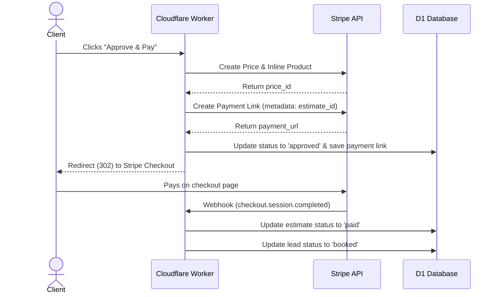

# Technical Specification: Estimates & Invoices for Branch Live

This document specifies the database design, SMS integration, routing, and payment flows for the **Estimates & Invoices** feature.

---

## 1. Landing Page Promise
*"Send quotes via text. Customer taps Approve. Converts to invoice. Stripe handles payment. No paper."*

---

## 2. Database Schema (`estimates`)

A new table `estimates` tracks the lifecycle of quotes.

```sql
CREATE TABLE IF NOT EXISTS estimates (
  id INTEGER PRIMARY KEY AUTOINCREMENT,
  user_id INTEGER NOT NULL,
  lead_id INTEGER,
  title TEXT DEFAULT "",
  items TEXT DEFAULT "[]", -- JSON array: [{"desc": "...", "qty": 1, "rate": 120.0}]
  total REAL DEFAULT 0.0,
  status TEXT DEFAULT "draft", -- draft, sent, approved, paid
  stripe_payment_link TEXT DEFAULT "",
  created_at TEXT DEFAULT (datetime('now'))
);
```

---

## 3. SMS Delivery via `sendSms()`

Estimates are dispatched via the existing `sendSms(env, { to, body })` helper.
- **Route:** `POST /api/estimates/:id/send` (Manager/Admin authorized)
- **Flow:**
  1. Fetch estimate by ID and verify owner (`user_id`).
  2. Resolve the client's phone number and name from the linked `leads` table (`caller_phone`, `caller_name`).
  3. Fetch the business slug from the `sites` table and business name from `settings`.
  4. Format the SMS body text:
     ```text
     Hi [Customer Name], this is [Business Name]. Here is your quote for [Title]: https://branchlive.com/s/[slug]/estimate/[id] Tap to review and approve.
     ```
  5. Invoke `sendSms()` and, if successful, update the status to `sent`.

---

## 4. Public Estimate View (`/s/{slug}/estimate/{id}`)

A public, login-free view for clients to review and approve their estimate.
- **Dynamic Styling:** Inherits the business's selected brand theme (e.g., Warm Craft) from the `sites` config.
- **Components:**
  - **Status Badge:** Visual status (`Sent`, `Approved`, or `Paid`).
  - **Line Items Grid:** Lists descriptions, quantities, rates, and the computed total.
  - **Call to Action:**
    - If `sent`: Displays an "Approve & Pay" button.
    - If `approved`: Displays "Resume Payment" linking to the generated Stripe Checkout page.
    - If `paid`: Shows a green success banner: "Paid — Thank you for your business!".

---

## 5. Stripe Integration & Webhook

Upon approval, the estimate is converted to a Stripe invoice dynamically.



### 5.1 Mock Payment (Demo Mode)
If Stripe credentials are not configured, approval updates status to `approved`, generates a demo URL `/s/{slug}/estimate/{id}?demo_success=true`, and updates the estimate to `paid` to simulate the payment workflow.

### 5.2 Webhook Handling
The Stripe webhook handler listens for `checkout.session.completed`:
1. Extracts `estimate_id` from metadata.
2. Updates `estimates.status` to `paid`.
3. Finds the linked `lead_id` and sets `leads.status` to `booked`.

---

## 6. Dashboard Interface (`/p/estimates`)

A manager-level UI accessed at `/p/estimates` using the existing styling guidelines.

- **Metrics Cards:** Draft, Sent, and Paid count/value summaries.
- **Table View:**
  - Shows date, title, customer name, total, and status badge.
  - Action items: "Send SMS" for drafts, "Resend SMS" / "View Link" for sent/approved, and "Paid" checkmark.
- **Creation Modal:**
  - Dropdown to select from active `leads` (`id`, `caller_name`).
  - Input fields for estimate title and line items.
  - Client-side Javascript dynamically calculates sub-totals and updates the overall `total` field.

---

## 7. Lead Detail Integration (`/p/leads/:id`)

Integrates quotes directly into the lead's history timeline within `handleLeadDetailHtmx()`.

- **Quotes Panel:** Shows a summary list of all estimates associated with the lead.
- **Columns:** Date, Title (linked to the public view), Total, and Status.
- **CTA:** A "+ Create Estimate" button prepopulating the Lead ID.
