# Technical Specification: Google Business Profile Auto-Management

This document specifies the design, database integration, routing conventions, user flows, and code changes required to implement the Google Business Profile (GBP) Auto-Management feature (Feature #14 on landing page) for **Branch Live**.

---

## 1. Overview & Product Goal

For local service businesses and professionals, keeping their Google Business Profile current is critical for local search rankings (SEO map pack). However, manually managing hours, uploading photos, and posting updates is time-consuming and often forgotten.

The **Google Business Profile Auto-Management** feature delivers on the promise:  
*"Hours, photos, and posts kept current automatically. Higher local search ranking without managing it."*

This is implemented as a lightweight background synchronization system that:
* **Auto-Syncs Business Hours**: When a business owner updates their working hours in the Branch Live settings, the changes sync to their GBP profile instantly.
* **Auto-Syncs Photos**: Uploading new job photos (before/after/during) to the gallery automatically posts them to their GBP photos section.
* **Auto-Syncs Posts**: Publishing a new blog post or social update auto-publishes it as a Local Post (Google Post) on their GBP.
* **Integrates with Review Monitoring**: Automatically binds the location using the existing `GOOGLE_PLACES_API_KEY` and the user's `google_place_id`.

*Note: In accordance with our language guidelines, the term "contractor" is never used in code, UI, or variable names. Instead, "business", "service business", or "professional" is used.*

---

## 2. Database Schema & Migration

We add new settings columns to the existing `settings` table to track the subscription status, OAuth tokens, linked locations, and individual sync preferences.

### 2.1 Schema Definition (`settings` table)

| Column | Type | Default | Description |
|--------|------|---------|-------------|
| `addon_gprofile` | `INTEGER` | `0` | Billing flag for Google Business Profile Sync ($14.95/mo) |
| `gprofile_refresh_token` | `TEXT` | `""` | Persistent Google OAuth refresh token for background sync |
| `gprofile_email` | `TEXT` | `""` | Email address of the connected Google Account |
| `gprofile_location_id` | `TEXT` | `""` | Linked location resource name (e.g., `locations/123456789`) |
| `gprofile_location_name` | `TEXT` | `""` | Human-readable location title (e.g., "Riverside Plumbing Co") |
| `gprofile_sync_hours` | `INTEGER` | `1` | Enable/disable automatic business hours sync (0/1) |
| `gprofile_sync_photos` | `INTEGER` | `1` | Enable/disable automatic photo gallery sync (0/1) |
| `gprofile_sync_posts` | `INTEGER` | `1` | Enable/disable automatic blog/social posts sync (0/1) |
| `gprofile_sync_status` | `TEXT` | `""` | Logs sync state or error messages (e.g., rate limits, invalid tokens) |
| `gprofile_last_sync` | `TEXT` | `""` | ISO timestamp of the last successful sync operation |

### 2.2 Migration Implementation
The migration must be idempotent and run inside the `initDB()` function in [worker.js](file:///C:/Users/17173/Projects/branchlive/worker.js).

```js
    // Migration: Google Business Profile Auto-Management columns
    // Key settings for tracking addon state, OAuth refresh tokens, and sync states.
    const gprofileColumns = [
      { name: 'addon_gprofile', type: 'INTEGER DEFAULT 0' },
      { name: 'gprofile_refresh_token', type: 'TEXT DEFAULT ""' },
      { name: 'gprofile_email', type: 'TEXT DEFAULT ""' },
      { name: 'gprofile_location_id', type: 'TEXT DEFAULT ""' },
      { name: 'gprofile_location_name', type: 'TEXT DEFAULT ""' },
      { name: 'gprofile_sync_hours', type: 'INTEGER DEFAULT 1' },
      { name: 'gprofile_sync_photos', type: 'INTEGER DEFAULT 1' },
      { name: 'gprofile_sync_posts', type: 'INTEGER DEFAULT 1' },
      { name: 'gprofile_sync_status', type: 'TEXT DEFAULT ""' },
      { name: 'gprofile_last_sync', type: 'TEXT DEFAULT ""' }
    ];

    for (const col of gprofileColumns) {
      try {
        await env.DB.prepare(`ALTER TABLE settings ADD COLUMN ${col.name}`).run();
      } catch(e) {
        // Swallowed if column already exists
      }
    }
```

Add `addon_gprofile` to the `ADDONS` configuration dictionary in [worker.js](file:///C:/Users/17173/Projects/branchlive/worker.js#L915) to register it with our Stripe billing system:
```js
const ADDONS = {
  // ... existing addons
  gprofile: { column: 'addon_gprofile', label: 'Google Profile Sync', icon: '🌐', price: 14.95, priceId: null },
};
```

---

## 3. Integration with Existing GOOGLE_PLACES_API_KEY Secret

Currently, the review monitoring add-on (`addon_reviews`) pulls reviews from the Google Places API using `GOOGLE_PLACES_API_KEY` (wrangler secret) and a manually entered `google_place_id`. 

We leverage this configuration during the GBP OAuth flow for **zero-touch setup**:
1. When the user completes the OAuth authorization callback, the worker queries Google's **Business Information API** for the list of locations managed by the user's account.
2. For each location, Google returns metadata containing the location's Place ID:
   `metadata.placeId`
3. The worker matches this against the user's existing `settings.google_place_id`:
   * **If a match is found**: The system automatically saves the location ID (`gprofile_location_id`) and location title (`gprofile_location_name`) in the database.
   * **If no match is found** (or `google_place_id` is empty): The system matches the location's `title` against the user's registered `business_name` or `company`. Upon a matching title, it automatically writes **both** `gprofile_location_id` AND updates `google_place_id` in settings. This automatically enables and configures the Review Monitoring badge feature as a side benefit!

---

## 4. OAuth 2.0 Flow for Business Owners

We reuse the existing platform Google credentials `GOOGLE_CLIENT_ID` and `GOOGLE_CLIENT_SECRET` (which are already configured for the Gmail integration).

### 4.1 OAuth Scope Requirement
Google Business Profile actions require the Google My Business / Business Profile management scope:
* `https://www.googleapis.com/auth/business.manage` (or `https://www.googleapis.com/auth/businessprofile.manage`)
* Standard identity scopes: `https://www.googleapis.com/auth/userinfo.email` and `openid`

### 4.2 Route Definitions

| Method | Path | Handler | Description |
|--------|------|---------|-------------|
| `GET` | `/api/gprofile/auth` | `handleGProfileAuth()` | API-only redirect to Google consent screen (requires Bearer auth) |
| `GET` | `/api/gprofile/auth-htmx` | `handleGProfileAuthHtmx()` | Cookie-authed handler for dashboard UI redirect |
| `GET` | `/api/gprofile/callback` | `handleGProfileCallback()` | Public callback endpoint (Google redirects here) |
| `GET` | `/api/gprofile/status-htmx` | `handleGProfileStatusHtmx()` | Fetches connected state for UI card |
| `POST` | `/api/gprofile/disconnect-htmx` | `handleGProfileDisconnectHtmx()` | Clears refresh tokens and location associations |

### 4.3 OAuth Sequence Workflow

```mermaid
sequenceDiagram
    autonumber
    actor User as Business Owner
    participant Browser as UI Dashboard
    participant Worker as Cloudflare Worker
    participant GoogleAuth as Google Identity Server
    participant GoogleAPI as Google Business API
    participant D1 as D1 Database

    User->>Browser: Clicks "Connect Google Business Profile"
    Browser->>Worker: GET /api/gprofile/auth-htmx (cookie-authed)
    Worker->>Browser: 302 Redirect to Google OAuth consent page
    Browser->>GoogleAuth: User grants permission
    GoogleAuth->>Worker: Redirects to /api/gprofile/callback?code=CODE&state=STATE
    
    rect rgb(30, 30, 45)
        note right of Worker: Token exchange & Location matching
        Worker->>GoogleAuth: POST /token (Exchange code for access & refresh tokens)
        GoogleAuth-->>Worker: Returns access_token & refresh_token
        Worker->>GoogleAPI: GET /v2/userinfo (Auth: Bearer access_token)
        GoogleAPI-->>Worker: Returns connected email address
        Worker->>GoogleAPI: GET /v1/accounts (Fetch GBP accounts)
        GoogleAPI-->>Worker: Returns list of Accounts
        Worker->>GoogleAPI: GET /v1/{account}/locations (Fetch Locations)
        GoogleAPI-->>Worker: Returns location details (title, metadata.placeId)
    end
    
    Worker->>D1: Match placeId/title, update settings table
    D1-->>Worker: Confirm updated
    Worker-->>Browser: Return HTML (Connection success page, self-closes)
    Browser-->>User: Visual success. Card re-renders to "Connected"
```



### 4.4 OAuth Callback Handler Blueprint (`worker.js`)
```js
async function handleGProfileCallback(request, env) {
  try {
    const url = new URL(request.url);
    const code = url.searchParams.get('code');
    const stateRaw = url.searchParams.get('state');
    if (!code || !stateRaw) return new Response('Missing code or state', { status: 400 });

    let state;
    try { state = JSON.parse(atob(stateRaw)); } catch (e) { return new Response('Invalid state', { status: 400 }); }
    const uid = state.uid;

    const clientId = env.GOOGLE_CLIENT_ID;
    const clientSecret = env.GOOGLE_CLIENT_SECRET;
    if (!clientId || !clientSecret) return new Response('OAuth not configured', { status: 500 });

    // 1. Exchange auth code for tokens
    const tokenResp = await fetch('https://oauth2.googleapis.com/token', {
      method: 'POST',
      headers: { 'Content-Type': 'application/x-www-form-urlencoded' },
      body: new URLSearchParams({
        code,
        client_id: clientId,
        client_secret: clientSecret,
        redirect_uri: 'https://branchlive-portal.shane-f58.workers.dev/api/gprofile/callback',
        grant_type: 'authorization_code'
      }).toString()
    });
    const tokenData = await tokenResp.json();
    if (tokenData.error) return new Response(`OAuth Error: ${tokenData.error}`, { status: 400 });

    // 2. Fetch User Email Profile
    const profileResp = await fetch('https://www.googleapis.com/oauth2/v2/userinfo', {
      headers: { 'Authorization': `Bearer ${tokenData.access_token}` }
    });
    const profile = await profileResp.json();
    const email = profile.email || '';

    // 3. Resolve location association using google_place_id
    const settings = await env.DB.prepare(
      'SELECT google_place_id, business_name FROM settings WHERE user_id = ?'
    ).bind(uid).first();
    const existingPlaceId = settings?.google_place_id || '';
    const bizName = settings?.business_name || '';

    let matchedLocationId = '';
    let matchedLocationTitle = '';
    let resolvedPlaceId = existingPlaceId;

    // Fetch Accounts
    const accResp = await fetch('https://mybusinessbusinessinformation.googleapis.com/v1/accounts', {
      headers: { 'Authorization': `Bearer ${tokenData.access_token}` }
    });
    const accData = await accResp.json();
    const accounts = accData.accounts || [];

    for (const account of accounts) {
      const locResp = await fetch(`https://mybusinessbusinessinformation.googleapis.com/v1/${account.name}/locations?readMask=name,title,metadata`, {
        headers: { 'Authorization': `Bearer ${tokenData.access_token}` }
      });
      const locData = await locResp.json();
      const locations = locData.locations || [];

      // Match logic
      const matched = locations.find(l => l.metadata?.placeId && l.metadata.placeId === existingPlaceId) || 
                      locations.find(l => l.title?.toLowerCase() === bizName.toLowerCase()) ||
                      locations[0]; // fallback to first location

      if (matched) {
        matchedLocationId = matched.name;
        matchedLocationTitle = matched.title;
        resolvedPlaceId = matched.metadata?.placeId || existingPlaceId;
        break;
      }
    }

    // 4. Update settings
    await env.DB.prepare(
      `UPDATE settings SET 
        gprofile_email = ?, 
        gprofile_refresh_token = ?, 
        gprofile_location_id = ?, 
        gprofile_location_name = ?,
        google_place_id = ?
       WHERE user_id = ?`
    ).bind(email, tokenData.refresh_token || '', matchedLocationId, matchedLocationTitle, resolvedPlaceId, uid).run();

    return new Response(
      `<html><body style="font-family:Inter,sans-serif;background:#06060c;color:#f1f5f9;display:flex;align-items:center;justify-content:center;height:100vh;text-align:center">
        <div>
          <h1 style="color:#00d4aa">✅ Google Business Profile Connected!</h1>
          <p style="color:#94a3b8;font-size:1.1em">${matchedLocationTitle || 'Location Bound'}</p>
          <p style="color:#6b7d95">You can close this window. Sync actions will run in the background.</p>
        </div>
      </body></html>`,
      { headers: { 'Content-Type': 'text/html' } }
    );
  } catch (e) {
    console.error('Google Profile OAuth Callback Error:', e);
    return new Response('OAuth callback processing failed.', { status: 500 });
  }
}
```

---

## 5. Auto-Sync Triggers (Real-Time Sync)

Sync actions execute asynchronously using `ctx.waitUntil` to prevent adding latency to the user's HTTP dashboard requests. If the sync action fails, the error details are caught, logged, and written to `settings.gprofile_sync_status`.

### 5.1 Trigger 1: Business Hours Update
When `working_hours` are updated on the Settings form (POST `/settings-htmx` / `/api/settings`):
1. Check if `addon_gprofile = 1`, `gprofile_refresh_token` exists, and `gprofile_sync_hours = 1`.
2. Convert the internal `working_hours` JSON object into the Google API `regularHours` periods.
3. Access Token Request: Refresh access token using `gprofile_refresh_token`.
4. API call to update hours:
   ```http
   PATCH https://mybusinessbusinessinformation.googleapis.com/v1/{gprofile_location_id}?updateMask=regularHours
   Authorization: Bearer [ACCESS_TOKEN]
   Content-Type: application/json

   {
     "regularHours": {
       "periods": [
         {
           "openDay": "MONDAY",
           "openTime": { "hours": 9, "minutes": 0 },
           "closeDay": "MONDAY",
           "closeTime": { "hours": 17, "minutes": 0 }
         }
       ]
     }
   }
   ```

### 5.2 Trigger 2: Photo Gallery Upload
When a photo is successfully uploaded to the gallery (POST `/api/photos`):
1. Check if `addon_gprofile = 1`, `gprofile_refresh_token` exists, and `gprofile_sync_photos = 1`.
2. Access Token Request: Refresh access token.
3. API call to publish photo to GBP media library:
   ```http
   POST https://mybusinessbusinessinformation.googleapis.com/v1/{gprofile_location_id}/media
   Authorization: Bearer [ACCESS_TOKEN]
   Content-Type: application/json

   {
     "mediaFormat": "PHOTO",
     "sourceUrl": "https://branchlive-portal.shane-f58.workers.dev/static/gallery/[PHOTO_FILENAME]",
     "caption": "[CAPTION_TEXT]"
   }
   ```

### 5.3 Trigger 3: Blog/Social Post Publish
When a blog post generates & publishes (`/api/blog/generate`), or a social post completes publishing (`/api/social/publish`):
1. Check if `addon_gprofile = 1`, `gprofile_refresh_token` exists, and `gprofile_sync_posts = 1`.
2. Access Token Request: Refresh access token.
3. Fetch post title/text content. Extract a snippet if text exceeds 1,500 characters.
4. API call to create local post:
   ```http
   POST https://mybusinessbusinessinformation.googleapis.com/v1/{gprofile_location_id}/localPosts
   Authorization: Bearer [ACCESS_TOKEN]
   Content-Type: application/json

   {
     "languageCode": "en-US",
     "summary": "[POST_TEXT_SNIPPET]",
     "callToAction": {
       "actionType": "LEARN_MORE",
       "url": "https://branchlive-portal.shane-f58.workers.dev/s/[SLUG]/blog/[POST_SLUG]"
     }
   }
   ```

---

## 6. Settings Page Integration (HTMX UI)

The GBP integration lives inside the settings panel rendered by `settingsHtmxBody` in `worker.js`. Following the modular, lightweight design principles of Branch Live, there is no custom configuration screen; all interactions fit inside a single dashboard card below the Google Calendar card.

### 6.1 Gated State (Addon Inactive)
If `addon_gprofile` is `0`, a callout redirects the business owner to Billing to upgrade:
```html
<div class="card" style="margin-bottom:20px;border-color:rgba(212,165,116,.4)">
  <div style="display:flex;align-items:center;gap:12px">
    <span style="font-size:1.4rem">🌐</span>
    <div>
      <strong style="font-size:1.05rem">Google Profile Auto-Sync</strong>
      <div style="font-size:.9em;color:var(--text-muted)">Auto-sync business hours, photos, and posts directly to Google Search & Maps — $14.95/mo.</div>
    </div>
  </div>
  <div style="margin-top:14px"><a class="btn btn-amber btn-sm" href="/p/billing">Enable in Billing →</a></div>
</div>
```

### 6.2 Active Settings Card Layout
When the addon is active, the card displays dynamic connection status and real-time synchronization toggles:

```html
<div class="card glow" style="margin-bottom:20px">
  <div style="display:flex;align-items:center;justify-content:space-between;gap:12px;flex-wrap:wrap">
    <div>
      <strong style="font-size:1.05rem">🌐 Google Business Profile Sync</strong>
      <div id="gprofile-status" style="margin-top:6px;font-size:.9em;color:var(--text-muted)">⏳ Checking connection...</div>
    </div>
    <div id="gprofile-actions" style="display:flex;gap:8px;align-items:center"></div>
  </div>
  
  <!-- Sync Settings Panel (visible only when connected) -->
  <div id="gprofile-settings-panel" style="display:none;margin-top:16px;border-top:1px solid var(--border-soft);padding-top:14px">
    <label style="display:block;font-size:.78rem;font-family:var(--font-mono);letter-spacing:.04em;color:var(--text-muted);margin-bottom:10px;text-transform:uppercase">Auto-Sync Rules</label>
    <div style="display:grid;grid-template-columns:1fr;gap:10px">
      <label style="display:flex;align-items:center;gap:10px;cursor:pointer">
        <input type="checkbox" name="gprofile_sync_hours" value="1" ${s.gprofile_sync_hours ? 'checked' : ''}>
        <span style="font-size:.9em">Synchronize business hours updates instantly</span>
      </label>
      <label style="display:flex;align-items:center;gap:10px;cursor:pointer">
        <input type="checkbox" name="gprofile_sync_photos" value="1" ${s.gprofile_sync_photos ? 'checked' : ''}>
        <span style="font-size:.9em">Publish gallery photos to Google Maps media</span>
      </label>
      <label style="display:flex;align-items:center;gap:10px;cursor:pointer">
        <input type="checkbox" name="gprofile_sync_posts" value="1" ${s.gprofile_sync_posts ? 'checked' : ''}>
        <span style="font-size:.9em">Push blog and social updates as Local Google Posts</span>
      </label>
    </div>
  </div>
  <p style="color:var(--text-faint);font-size:.82em;margin:12px 0 0">Keeps your Google business hours, media, and search posts updated automatically without leaving your dashboard.</p>
</div>
```

### 6.3 Client-Side Javascript Controller
Directly embedded inside `settingsHtmxBody`'s scripts to drive status queries and disconnections:
```html
<script>
  (function() {
    // Queries connection status asynchronously on page render
    fetch('/api/gprofile/status-htmx', { credentials: 'same-origin' })
      .then(function(r) { return r.json(); })
      .then(function(d) { gprofileRender(d); })
      .catch(function() {
        var st = document.getElementById('gprofile-status');
        if (st) st.textContent = '❌ Could not load Google Business connection status.';
      });
  })();

  function gprofileRender(state) {
    var st = document.getElementById('gprofile-status');
    var act = document.getElementById('gprofile-actions');
    var panel = document.getElementById('gprofile-settings-panel');
    
    if (state.connected) {
      st.innerHTML = '🟢 Connected as <strong class="mono" style="color:var(--accent-amber)">' + (state.email || 'Google Account') + '</strong>' +
                     '<div style="font-size:.85em;color:var(--text-faint);margin-top:2px">Location: ' + (state.location_name || 'Bound') + '</div>';
      act.innerHTML = '<button class="btn btn-ghost btn-sm" style="color:var(--danger);border-color:rgba(248,113,113,.4)" onclick="gprofileDisconnect()">Disconnect</button>';
      if (panel) panel.style.display = 'block';
      
      // If a sync warning exists in state, render it in red
      if (state.sync_status && state.sync_status.startsWith('Error')) {
        st.innerHTML += '<div style="color:var(--danger);font-size:.8em;margin-top:4px">⚠️ ' + state.sync_status + '</div>';
      }
    } else {
      st.innerHTML = '⚪ Not connected — updates are not synced to Google.';
      act.innerHTML = '<a class="btn btn-sm" href="/api/gprofile/auth-htmx" target="_blank" rel="noopener">🌐 Connect Google Profile</a>';
      if (panel) panel.style.display = 'none';
    }
  }

  async function gprofileDisconnect() {
    if (!confirm('Disconnect Google Business Profile? Your search hours, photos, and updates will no longer sync.')) return;
    try {
      var r = await fetch('/api/gprofile/disconnect-htmx', { method: 'POST', credentials: 'same-origin' });
      var d = await r.json();
      if (d.ok) gprofileRender({ connected: false });
    } catch(e) {
      alert('Connection error');
    }
  }
</script>
```

---

## 7. Periodic Sync Cron (Daily Sweeper)

To ensure high data integrity and catch any out-of-sync states (e.g., if a real-time webhook failed, Google APIs went down temporarily, or hours were modified directly on Google), a daily cron job runs a full reconciliation pass.

### 7.1 Cron Setup
* **Endpoint**: `POST /api/cron/gprofile-sync`
* **Trigger Interval**: Configured in `wrangler.jsonc` to run daily at 3:00 AM local server time:
  ```jsonc
  {
    "triggers": {
      "crons": ["0 3 * * *"]
    }
  }
  ```

### 7.2 Sweeper Execution Logic
1. **Identify Candidates**: Select all user profiles in the `settings` database where `addon_gprofile = 1` and `gprofile_refresh_token` is not empty.
2. **Refresh Access Tokens**: For each client, fetch a temporary access token from Google using their refresh token.
3. **Synchronize Hours**:
   * Fetch current GBP settings: `GET https://mybusinessbusinessinformation.googleapis.com/v1/{gprofile_location_id}`.
   * Compare `regularHours` values between Google and the local DB `working_hours` object.
   * If different, perform a `PATCH` update.
4. **Reconcile Photos**:
   * Query the user's local `photos` table for records created in the last 24 hours.
   * If new images exist and `gprofile_sync_photos = 1`, upload them via the Media API.
5. **Reconcile Posts**:
   * Query the `business_blog_posts` and `social_posts` tables for entries successfully published in the last 24 hours.
   * Cross-reference to ensure they exist on GBP; post them if missing.
6. **Log Results**: Update the `gprofile_last_sync` timestamp and write "Success" (or specific warnings) to the `gprofile_sync_status` database column.

---

## 8. Error Handling & Rate Limits

Google's APIs enforce rate limits on write commands to prevent spam. Our sync modules degrade gracefully rather than throwing critical thread-blocking exceptions.

### 8.1 API Rate Limits (429 Too Many Requests)
* **Strategy**: When the Google Business Profile API responds with HTTP `429`, the worker catches the error, aborts the current sweep for that location, and schedules it to retry during the next daily cron.
* **Warning Logger**: The system writes `'Error: Rate Limit Exceeded'` into `settings.gprofile_sync_status`. This renders on the settings card, notifying the business owner that their sync is temporarily throttled without breaking other dashboard features.

### 8.2 Token Revocation & Expiry (400/401 Unauthorized)
* **Strategy**: If a request to update fails due to an invalid/expired token (e.g., the user revoked permissions from their Google security panel, or the password was changed):
  1. The worker resets the connection states: clears `gprofile_location_id` and `gprofile_refresh_token`.
  2. Sets `gprofile_sync_status = 'Error: Connection expired. Please reconnect your account.'`.
  3. The settings page immediately renders the reconnect warning and redirects the user back to the OAuth button.
