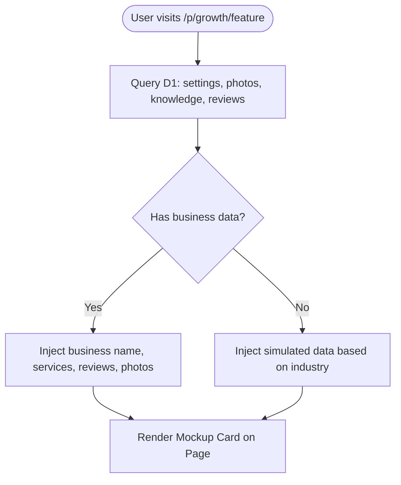

# Technical Specification: Growth Feature Previews

This document specifies the routing, database querying, live preview layout, and Stripe/HTMX upsell flows for the **Growth Feature Previews** (Website, Blog, and Social add-ons) in Branch Live.

---

## 1. Landing Page Interstitials

To improve conversions, each Growth section page displays a personalized landing/preview page rather than redirecting to a locked or empty state when an add-on is disabled. 

### 1.1 Redirection Rules
- When a user accesses `/p/website`, `/p/blog`, or `/p/social`, the route handler checks the add-on status via `userHasFeature(settings, addonKey)`.
- If disabled, the handler returns a `302 Redirect` to `/p/growth/{website|blog|social}`.
- If enabled, the page loads the active feature handler (e.g., `handleWebsiteBuilderHtmx`).

---

## 2. Route Definitions

The new interstitial routes are defined in [routes.md](file:///C:/Users/17173/.gemini/antigravity-cli/scratch/wiki_copy/routes.md):

| Method | Path | Handler | Description |
|--------|------|---------|-------------|
| GET | `/p/growth/website` | `handleGrowthPreview('website')` | Website Builder preview page |
| GET | `/p/growth/blog` | `handleGrowthPreview('blog')` | AI Blog Posts preview page |
| GET | `/p/growth/social` | `handleGrowthPreview('social')` | Social Auto-Posting preview page |

---

## 3. Video Embed Configuration

Each preview page displays an explainer video highlighting the feature value proposition. Videos and headlines are configured via a static map in [worker.js](file:///C:/Users/17173/.gemini/antigravity-cli/scratch/worker_utf8.js):

```js
const GROWTH_EXPLAINERS = {
  website: {
    youtubeId: 'YOUTUBE_ID_WEBSITE', // To be updated
    headline: 'Your Business on the Web, Handled',
    sub: 'Get a beautiful, mobile-friendly site that automatically showcases your projects and reviews.'
  },
  blog: {
    youtubeId: 'YOUTUBE_ID_BLOG',
    headline: 'SEO Blog Posts Written by AI',
    sub: 'Increase your search rankings and attract local customers with localized industry articles.'
  },
  social: {
    youtubeId: 'YOUTUBE_ID_SOCIAL',
    headline: 'Auto-Post Projects & Reviews',
    sub: 'Keep your Facebook and Instagram pages active automatically using your recent project photos.'
  }
};
```

---

## 4. Live Preview Engine

The core feature is a live mockup rendered using the business's own data from the D1 database.



### 4.1 Data Query
The controller queries the following tables (refer to [tables.md](file:///C:/Users/17173/.gemini/antigravity-cli/scratch/wiki_copy/tables.md)):
```js
const [site, settings, photosRow, servicesRow, reviewsRow] = await Promise.all([
  env.DB.prepare('SELECT * FROM sites WHERE user_id = ?').bind(uid).first(),
  env.DB.prepare('SELECT business_name, industry, service_area FROM settings WHERE user_id = ?').bind(uid).first(),
  env.DB.prepare('SELECT data FROM photos WHERE user_id = ? ORDER BY created_at DESC LIMIT 2').bind(uid).all(),
  env.DB.prepare('SELECT item, price FROM knowledge WHERE user_id = ? AND category = "Services" LIMIT 2').bind(uid).all(),
  env.DB.prepare('SELECT author_name, rating, text FROM reviews WHERE user_id = ? AND rating >= 4 ORDER BY reviewed_at DESC LIMIT 1').bind(uid).first()
]);
```

### 4.2 Mockup Generation & Fallbacks

#### 4.2.1 Website Mockup (`/p/growth/website`)
- **Mockup Details:** Renders a simplified desktop browser frame. 
- **Personalized Data:** Header displays `settings.business_name` (fallback: "your business"). Hero title reads: `"Premium Services in ${settings.service_area || 'Your Area'}"`. Renders a grid with 2 services from `knowledge` and 2 project photos from `photos`.
- **Fallback:** If `photos` is empty, display pre-styled amber placeholder SVGs. If `knowledge` is empty, list standard services for the business's `industry`.

#### 4.2.2 AI Blog Mockup (`/p/growth/blog`)
- **Mockup Details:** Renders a clean reading layout simulating a blog post page.
- **Personalized Data:**
  - Title: `"Why Quality ${service || 'Service'} Matters in ${settings.service_area || 'Your Area'}"`
  - Body: `"Homeowners in ${settings.service_area} trust the team at ${settings.business_name} for reliable ${service || 'home services'}..."`
- **Fallback:** Fall back to the business's `industry` for the article topic if no services are defined in `knowledge`.

#### 4.2.3 Social Mockup (`/p/growth/social`)
- **Mockup Details:** Renders a Facebook/Instagram social card container.
- **Personalized Data:** 
  - Profile Header: `settings.business_name` with a custom icon.
  - Caption: `"Another 5-star review from our client! ⭐⭐⭐⭐⭐\n'${reviewsRow.text}' — ${reviewsRow.author_name}"`
  - Image: Renders the latest photo from `photos`.
- **Fallback:** If no reviews/photos exist: `"No time to write updates? Emma drafts social posts for services like ${service || 'your service projects'} automatically."` alongside an amber camera icon.

---

## 5. UI Layout & Styling (Amber-Monotone)

In compliance with the system's design guidelines in [patterns.md](file:///C:/Users/17173/.gemini/antigravity-cli/scratch/wiki_copy/patterns.md):
- **Theme:** Monotone dark amber style (`#0a0a14` backgrounds, `var(--accent-amber)` for elements and borders).
- **Layout:** A grid container displaying the YouTube explainer on the left and the Live Preview Mockup Card (`.card.glow`) on the right.
- **Live Preview Badge:** A clear container with the label `"LIVE PREVIEW (Your Data)"` using `border: 1px solid var(--accent-amber)` and `color: var(--accent-amber)`.

---

## 6. Stripe Add-on Upsell Flow

The CTA button integrates with the existing Stripe system defined in [patterns.md](file:///C:/Users/17173/.gemini/antigravity-cli/scratch/wiki_copy/patterns.md):

1. **CTA Target:** Clicks trigger a POST to `/api/addon/unlock-htmx` with `{ addon: 'website'|'blog'|'social', enabled: true }`.
2. **Local Toggle & Stripe Sync:** 
   - Invokes `handleAddonToggle(request, env, uid)`.
   - Persists settings database toggle to `1` (instant local unlock).
   - Syncs subscription item details to Stripe asynchronously.
3. **Redirect Flow:**
   - On success (`{ ok: true }`), the client receives an `HX-Redirect` targeting `/p/{website|blog|social}` to view the fully-unlocked page.
   - If Stripe is unconfigured, the toggle operates in local demo mode, displaying a warning toast.
