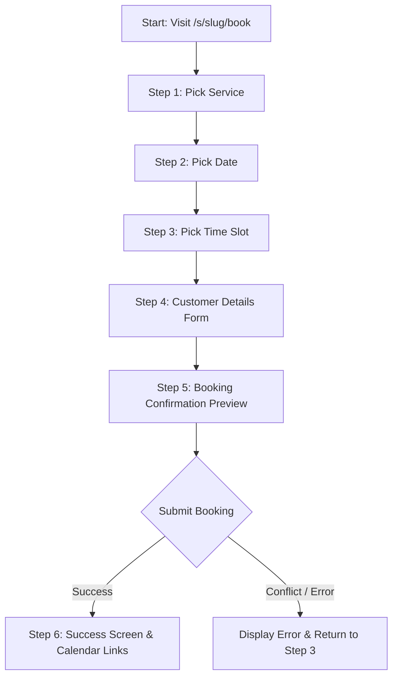

# Technical Specification: Public Booking Page (/s/{slug}/book)

This document specifies the design, database integration, routing conventions, slot generation algorithm, and frontend styling for the public-facing booking page feature for **Branch Live**.

---

## 1. Overview & User Flow

The public booking feature enables clients of a Branch Live business to schedule appointments directly online. 
* **URL Structure**: `/s/{slug}/book`
* **Access Control**: Public-facing, no authentication or login required.
* **Branding**: Dedicated standalone page matching the business's accent color (with a premium **amber-monotone** styling system) instead of the standard dashboard `simpleShell()`.

### Step-by-Step User Flow



1. **Step 1: Pick Service** — The user is presented with a list of active appointment types configured by the business.
2. **Step 2: Pick Date** — The user selects a date from an interactive calendar interface. Past dates and days when the business is closed (according to their working hours) are disabled.
3. **Step 3: Pick Time Slot** — The system fetches and generates available start times for the selected date, filtering out existing bookings, blocked slots, and respecting the required buffers.
4. **Step 4: Enter Details** — The user enters their `Name`, `Phone`, `Email`, and any specific `Notes` for the appointment.
5. **Step 5: Confirmation** — The user reviews their choices and clicks **Confirm Booking**.
6. **Step 6: Success Screen** — Displays confirmation message, transaction summary, and an "Add to Calendar" button (Google Calendar / ICS format).

---

## 2. Database Schema References

The implementation queries and updates the following tables:

### 2.1 `sites`
Used to validate the public URL slug and resolve the corresponding `user_id`.
* `slug` (TEXT, UNIQUE): The business's unique identifier in the URL.
* `user_id` (INTEGER): Foreign key linking the site to the business owner.
* `published` (INTEGER): Must be `1` for the booking page to render.

### 2.2 `settings`
Used to retrieve business identity, working hours, and general booking rules.
* `user_id` (INTEGER, PRIMARY KEY)
* `business_name` (TEXT): Displayed in the header.
* `working_hours` (TEXT): Operating hours format (e.g., `Mon-Fri 7am-5pm` or day-specific lists).
* `buffer_min` (INTEGER): Rest break duration required between appointments (defaults to `30`).
* `timezone` (TEXT): Database column (defaults to `America/New_York`).
* `time_format` (TEXT): Display convention (defaults to `'12h'`).

### 2.3 `appointment_types`
Determines the services available for booking.
* `id` (INTEGER, PRIMARY KEY)
* `user_id` (INTEGER)
* `name` (TEXT): Title of the service (e.g., "Standard Consultation").
* `duration_min` (INTEGER): Length of the appointment.
* `color` (TEXT): Visual highlight color.

### 2.4 `appointments`
Stores the scheduled appointments.
* `id` (INTEGER, PRIMARY KEY)
* `user_id` (INTEGER): Linked owner.
* `title` (TEXT): Stored as `[Service Name] - [Customer Name]`.
* `customer_name` (TEXT)
* `customer_phone` (TEXT)
* `date` (TEXT): Target date in `YYYY-MM-DD` format.
* `time` (TEXT): Start time in 24h format `HH:MM`.
* `duration_min` (INTEGER)
* `status` (TEXT): Defaults to `'confirmed'`.
* `notes` (TEXT)
* `appointment_type_id` (INTEGER)
* `buffer_enabled` (INTEGER): Defaults to `1`.
* `buffer_min` (INTEGER)
* `created_at` (TEXT)

### 2.5 `leads`
Ensures that all self-booked customers are automatically captured in the business's CRM pipeline.
* `id` (INTEGER, PRIMARY KEY)
* `user_id` (INTEGER)
* `caller_name` (TEXT): Stores the customer's name.
* `caller_phone` (TEXT): Customer's phone number.
* `caller_email` (TEXT): Customer's email.
* `job_details` (TEXT): Notes and booked service details.
* `status` (TEXT): Stored as `'booked'`.
* `created_at` (TEXT)
* `updated_at` (TEXT)

> [!WARNING]
> **Language Rule Reminder**: Under no circumstances should the word "contractor" be used in UI copy, code comments, or variables. Always refer to "business", "local business", or "professional".

---

## 3. Routing Architecture & Request Handling

Public routes must be placed in the **unauthenticated** section of the `fetch()` router block in `worker.js`, specifically above the token authentication gate (`const uid = await getUserId`).

### 3.1 GET `/s/{slug}/book`
Renders the standalone booking interface. It supports an optional `?date=YYYY-MM-DD` query parameter to return HTMX partials for time slots, avoiding full-page reloads.

#### Routing Registration (`worker.js` ~line 15780):
```js
// Business public booking page — matched BEFORE the /s/{slug} exact match
const bookPageMatch = path.match(/^\/s\/([a-z0-9-]+)\/book$/);
if (bookPageMatch) return handlePublicBookingPage(request, env, bookPageMatch[1]);
```

### 3.2 POST `/api/public/book`
Endpoint to submit the completed booking payload.

#### Routing Registration (`worker.js` ~line 16285):
```js
// Public booking submission
if (path === '/api/public/book' && method === 'POST') {
  return handleApiPublicBook(request, env);
}
```

---

## 4. Database Queries & Implementation

### 4.1 Lookup Site & User ID
```sql
SELECT user_id, published 
FROM sites 
WHERE slug = ? LIMIT 1;
```

### 4.2 Fetch Business Booking Settings & Appointment Types
```sql
-- Query 1: Fetch core configurations
SELECT business_name, working_hours, buffer_min, timezone, time_format 
FROM settings 
WHERE user_id = ? LIMIT 1;

-- Query 2: Fetch active booking options
SELECT id, name, duration_min, color 
FROM appointment_types 
WHERE user_id = ? 
ORDER BY name;
```

### 4.3 Query Date Conflicts (Existing Appointments & Blocks)
```sql
-- Query 1: Fetch appointments for the target date
SELECT time, duration_min, buffer_min, buffer_enabled 
FROM appointments 
WHERE user_id = ? AND date = ? AND status != 'cancelled';

-- Query 2: Fetch administrative blocked times
SELECT start_time, end_time, label 
FROM blocked_time 
WHERE user_id = ? AND date = ?;
```

---

## 5. Time Slot Generation Algorithm

To generate available booking slots, the system must inspect the business's daily working hours, increment the timeline in 30-minute intervals, and verify if a candidate slot conflicts with existing appointments or manual blockages.

### 5.1 Buffer Calculation Rules
As per the product guidelines, booking buffers must prevent back-to-back appointments.
* A buffer blocks out time **before** and **after** an appointment.
* *Example*: A 1-hour appointment from 2:00 PM to 3:00 PM with a 30-minute buffer blocks out the timeline from 1:30 PM to 3:30 PM.

Mathematically, a candidate slot starting at $S$ and ending at $E$ (where $E = S + \text{duration}$) is **valid** against an existing appointment starting at $A_S$ and ending at $A_E$ with buffer $B$ if and only if:
1. If the existing appointment is **after** the candidate: $A_S - E \ge B$
2. If the existing appointment is **before** the candidate: $S - A_E \ge B$
3. There is no direct overlap: $S < A_E$ and $E > A_S$ are false.

### 5.2 Slot Generator Algorithm (Javascript Reference)

```js
function getAvailableSlots(dateStr, durationMin, workingHoursStr, bufferMin, appointments, blockedTimes) {
  const slots = [];
  
  // 1. Determine day of the week
  const daysOfWeek = ['sun', 'mon', 'tue', 'wed', 'thu', 'fri', 'sat'];
  const dateObj = new Date(dateStr + 'T00:00:00');
  const dayName = daysOfWeek[dateObj.getDay()];

  // 2. Parse working hours (e.g. "Mon-Fri 7am-5pm" or "Mon 08:00-18:00, Tue 08:00-18:00")
  const wh = parseDayWorkingHours(workingHoursStr, dayName);
  if (!wh || !wh.open) return []; // Closed on this day

  const startMin = timeToMinutes(wh.start);
  const endMin = timeToMinutes(wh.end);

  // 3. Generate candidate slots in 30-minute steps
  for (let s = startMin; s + durationMin <= endMin; s += 30) {
    const e = s + durationMin;
    let isAvailable = true;

    // Check against manual blocks
    for (const block of blockedTimes) {
      const bStart = timeToMinutes(block.start_time);
      const bEnd = timeToMinutes(block.end_time || block.start_time);
      if (s < bEnd && e > bStart) {
        isAvailable = false;
        break;
      }
    }

    if (!isAvailable) continue;

    // Check against existing appointments & respect buffers on both sides
    for (const appt of appointments) {
      const apptStart = timeToMinutes(appt.time);
      const apptEnd = apptStart + (appt.duration_min || 60);
      const apptBuffer = appt.buffer_enabled ? (appt.buffer_min ?? bufferMin) : 0;
      
      // Candidate buffer and appointment buffer combined check
      const combinedBuffer = Math.max(bufferMin, apptBuffer);

      if (apptStart >= e) {
        // Appt is in the future relative to slot
        if (apptStart - e < combinedBuffer) {
          isAvailable = false;
          break;
        }
      } else if (apptEnd <= s) {
        // Appt is in the past relative to slot
        if (s - apptEnd < combinedBuffer) {
          isAvailable = false;
          break;
        }
      } else {
        // Direct overlap
        isAvailable = false;
        break;
      }
    }

    if (isAvailable) {
      slots.push(minutesToTime(s));
    }
  }

  return slots;
}

// Helpers
function timeToMinutes(t) {
  const [h, m] = t.split(':').map(Number);
  return h * 60 + m;
}

function minutesToTime(m) {
  const hrs = Math.floor(m / 60);
  const mins = m % 60;
  return `${String(hrs).padStart(2, '0')}:${String(mins).padStart(2, '0')}`;
}
```

---

## 6. Frontend Design (Amber-Monotone Standalone HTML)

The page must render without standard sidebar navigations or shell layouts. The color palette centers on **amber-monotone** to maintain a premium feel.

### 6.1 UI Mockup & Style Tokens
```css
:root {
  --amber-50: #fffbeb;
  --amber-100: #fef3c7;
  --amber-500: #f59e0b;
  --amber-600: #d97706;
  --amber-700: #b45309;
  --amber-900: #78350f;
  --neutral-900: #1e1b4b;
  --neutral-800: #1e293b;
  --neutral-100: #f1f5f9;
  --bg-main: #fafaf9;
}

body {
  font-family: 'Inter', system-ui, sans-serif;
  background-color: var(--bg-main);
  color: var(--neutral-800);
}

.booking-card {
  background: white;
  border-radius: 16px;
  border: 1px solid var(--amber-100);
  box-shadow: 0 4px 20px rgba(120, 53, 15, 0.05);
}

.btn-primary {
  background-color: var(--amber-600);
  color: white;
  transition: all 0.2s ease;
}
.btn-primary:hover {
  background-color: var(--amber-700);
  transform: translateY(-1px);
}
```

### 6.2 HTMX Progressive Disclosures
```html
<!-- Date Selector invokes slot loading -->
<input type="date" 
       name="date" 
       id="booking-date" 
       hx-get="/s/local-plumbing/book?action=slots" 
       hx-vals="js:{appt_type_id: document.getElementById('appt-type').value}" 
       hx-target="#slots-container" 
       hx-trigger="change" />

<!-- Slot target container -->
<div id="slots-container">
  <p class="text-muted">Please select a service and date to view available times.</p>
</div>
```

---

## 7. Error Handling & Validation Matrix

| Failure Mode | Trigger Condition | System Action | UI Presentation |
| :--- | :--- | :--- | :--- |
| **Invalid Slug** | URL slug doesn't exist in `sites` | Return `404` status code | Render standard `siteNotFoundShell()` |
| **Site Not Published** | `sites.published == 0` | Return `404` status code | Render standard `siteNotFoundShell()` |
| **No Services Configured** | `appointment_types` table is empty | Block booking wizard progress | Display: "This business hasn't configured booking services online yet. Please call to book." |
| **Date Outside Working Hours** | Target day's working hours is empty | Return `[]` slots | Disable date cell in picker / show "Closed" |
| **Conflict Detected** | Time slot booked concurrently | Return `409 Conflict` on POST | Alert: "This slot was just taken. Please select another time." |
| **Missing Fields** | Customer name/phone left blank | Return `400 Bad Request` | Display red error border around required fields |

---

## 8. Success Workflow & Confirmations

When a booking succeeds:
1. **D1 Writes**:
   * Insert new row into `appointments` containing the scheduled slot.
   * Insert new row into `leads` with status `'booked'`.
2. **Auto-notifications**:
   * If customer email is provided, trigger `sendEmail` with confirmation details.
   * Send notification email to the business owner (`users.email`).
   * Trigger SMS confirmation to the customer if `send_sms_reminder` was toggled.
3. **API Response**:
   * Return `{ ok: true, data: { date, time, customer_name, duration_min } }`.
