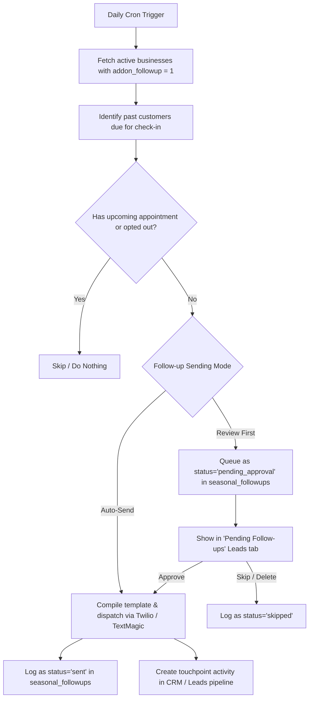
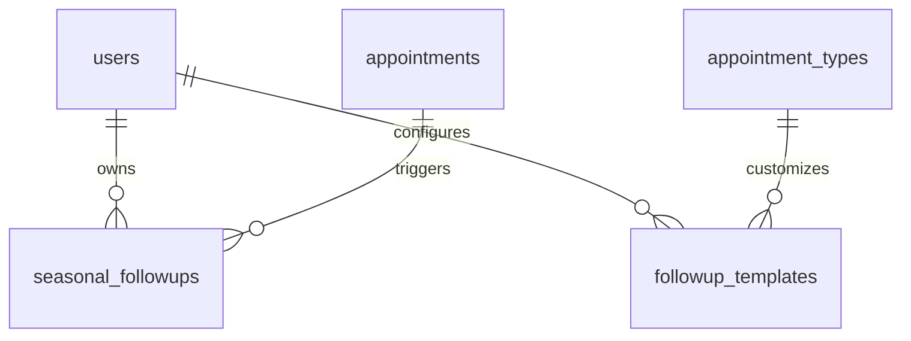

# Technical Specification: Seasonal Follow-ups (Feature #6)

This document specifies the design, database schema, trigger logic, message template system, daily cron scheduling, Twilio/TextMagic SMS integration, and frontend components for the **Seasonal Follow-ups** feature on **Branch Live**.

---

## 1. Overview & User Flow

The Seasonal Follow-ups feature helps local service businesses re-engage past customers automatically. By checking historical completed appointments, the system automatically sends personalized text check-ins at a set interval (default: 6 months) after the customer's last service, turning one-time jobs into repeat revenue.

### Key Value Propositions
* **Hands-off Repeat Revenue**: Automatically prompts past clients for seasonal maintenance, inspections, or repeat service.
* **Service-Specific Personalization**: Tailors the message based on the last type of service performed (e.g., AC tune-up vs. drain cleaning).
* **Consent & A2P Compliance**: Fully respects carrier opt-out requirements and checks customer consent state.
* **Flexible Delivery Modes**: Supports automated hands-free sending or manual draft review before dispatch.

### User Flow Diagram



---

## 2. Database Schema

To track seasonal follow-ups, templates, and execution history, two new tables will be added to the Cloudflare D1 database inside `initDB()`.



### 2.1 `seasonal_followups`
Tracks scheduled checks, drafts awaiting approval, and historical transmission logs.

| Column | Type | Constraints | Description |
| :--- | :--- | :--- | :--- |
| `id` | INTEGER | PRIMARY KEY AUTOINCREMENT | Unique log ID |
| `user_id` | INTEGER | REFERENCES users(id) | The business owner |
| `customer_name` | TEXT | NOT NULL | Customer name from the appointment |
| `customer_phone` | TEXT | NOT NULL | Customer phone number (E.164 normalized) |
| `last_appointment_id` | INTEGER | REFERENCES appointments(id) | ID of the service triggering this check-in |
| `scheduled_date` | TEXT | NOT NULL | YYYY-MM-DD when the follow-up is due |
| `status` | TEXT | DEFAULT 'pending_approval' | `'pending_approval'`, `'sent'`, `'failed'`, `'skipped'`, `'opted_out'` |
| `sent_at` | TEXT | NULL | ISO timestamp of actual dispatch |
| `sms_provider` | TEXT | NOT NULL | `'twilio'` or `'textmagic'` |
| `message_body` | TEXT | NOT NULL | Compiled text content of the SMS |
| `error_message` | TEXT | NULL | Description of failure if send failed |
| `created_at` | TEXT | DEFAULT (datetime('now')) | Creation timestamp |

#### Required Indexes
- `idx_followups_user_phone`: `(user_id, customer_phone)` - optimized for lead detail page queries.
- `idx_followups_status_date`: `(status, scheduled_date)` - optimized for daily cron lookup.

### 2.2 `followup_templates`
Allows business owners to customize follow-up templates by appointment type or set a global fallback template.

| Column | Type | Constraints | Description |
| :--- | :--- | :--- | :--- |
| `id` | INTEGER | PRIMARY KEY AUTOINCREMENT | Template ID |
| `user_id` | INTEGER | REFERENCES users(id) | The business owner |
| `appointment_type_id` | INTEGER | REFERENCES appointment_types(id) NULLABLE | Target service type. If NULL, acts as default fallback. |
| `message_template` | TEXT | NOT NULL | Text template with placeholders |
| `created_at` | TEXT | DEFAULT (datetime('now')) | |
| `updated_at` | TEXT | DEFAULT (datetime('now')) | |

#### Required Indexes
- `idx_followup_templates_user_type`: `UNIQUE(user_id, appointment_type_id)` - prevents duplicate templates for the same service.

### 2.3 Settings Schema Additions
The `settings` table will be extended with configuration flags (added via idempotent ALTER TABLE statements in `initDB()`):
* `addon_followup` (INTEGER DEFAULT 0) - Flag indicating active follow-up add-on subscription.
* `followup_interval_months` (INTEGER DEFAULT 6) - Target duration to wait since last service (1 to 12 months).
* `followup_sms_provider` (TEXT DEFAULT 'twilio') - Delivery channel: `'twilio'` or `'textmagic'`.
* `followup_sending_mode` (TEXT DEFAULT 'auto') - Execution rule: `'auto'` (hands-free) or `'review'` (requires approval).

---

## 3. SMS Template System

### 3.1 Template Placeholders
Templates support the following dynamic variables, which are replaced during message compilation:
* `{customer_name}`: Customer's display name.
* `{months}`: The follow-up interval configured by the business owner (e.g., `6`).
* `{service_name}`: The name of the customer's last service (resolved via `appointment_types.name`).
* `{business_name}`: The public business name configured in `settings.business_name`.
* `{business_phone}`: The outbound business number (defaults to `settings.forwarding_number`).

### 3.2 Compilation & Fallback Logic
When triggering a follow-up:
1. Lookup the `appointment_type_id` of the last completed appointment.
2. Query `followup_templates` matching both the `user_id` and `appointment_type_id`.
3. If no specific service template exists, query the default template for the business (`appointment_type_id IS NULL`).
4. If no custom default exists, fall back to the system default template:
   ```text
   Hi {customer_name}, it's been {months} months since your {service_name} with {business_name}. Ready for your next check-up? Reply to book or call us at {business_phone}.
   ```
5. Append compliance text to every message:
   ```text
   \n\nReply STOP to opt out.
   ```

---

## 4. Scheduling & Cron Engine

A daily cron trigger runs at off-peak hours to identify customers due for a follow-up. 

### 4.1 Daily Cron Registration (`wrangler.jsonc`)
Add the cron schedule target if not present, and handle the route `/api/cron/seasonal-followups`.
```json
{
  "cron": [
    "0 13 * * *" 
  ]
}
```
*Note: `13:00 UTC` corresponds to morning business hours (`8:00 AM EST` / `5:00 AM PST`) in target North American timezones.*

### 4.2 Candidate Selection Algorithm
For each active business with `addon_followup = 1`, the script executes a query to locate eligible past customers.

#### Eligibility Conditions:
1. **Last Appointment Completion**: The date of the customer's *latest* confirmed appointment is exactly $N$ months in the past.
2. **No Upcoming Appointments**: No confirmed appointment exists for the customer's phone number on or after today's date.
3. **No Recent Outreach**: No follow-up message has been sent to this customer within the last 30 days (prevents duplicate triggers in case of rescheduled work or multiple past numbers).
4. **Not Opted Out**: The phone number is not marked as `'opted_out'` in the logs.

```sql
WITH LastService AS (
  SELECT 
    customer_phone, 
    customer_name,
    MAX(date) as last_date,
    appointment_type_id,
    id as appt_id
  FROM appointments
  WHERE user_id = ? AND status = 'confirmed' AND date < CURRENT_DATE
  GROUP BY customer_phone
),
UpcomingService AS (
  SELECT DISTINCT customer_phone
  FROM appointments
  WHERE user_id = ? AND status = 'confirmed' AND date >= CURRENT_DATE
)
SELECT 
  ls.customer_phone,
  ls.customer_name,
  ls.last_date,
  ls.appointment_type_id,
  ls.appt_id
FROM LastService ls
LEFT JOIN UpcomingService us ON ls.customer_phone = us.customer_phone
WHERE us.customer_phone IS NULL
  AND ls.last_date = date('now', '-' || ? || ' month')
  AND NOT EXISTS (
    SELECT 1 FROM seasonal_followups sf 
    WHERE sf.user_id = ? 
      AND sf.customer_phone = ls.customer_phone 
      AND sf.created_at >= date('now', '-30 day')
  );
```

### 4.3 Dispatch Processing
For each eligible customer:
1. **Compile**: Resolve the correct template and replace all placeholders.
2. **Dispatch / Queue**:
   * **If `followup_sending_mode == 'auto'`**: 
     Invoke `sendSms` (Twilio) or `sendTextMagicSms` (TextMagic) immediately. Log the result in `seasonal_followups` with `status = 'sent'` or `status = 'failed'`.
   * **If `followup_sending_mode == 'review'`**:
     Insert a row in `seasonal_followups` with `status = 'pending_approval'`, `scheduled_date = CURRENT_DATE`, and the compiled `message_body`.

---

## 5. Gateway Integration (Twilio / TextMagic)

The system leverages existing SMS helpers in `worker.js`. 

### 5.1 Twilio Channel (`sendSms`)
Used when `followup_sms_provider` is set to `'twilio'`. Calls the core `sendSms(env, { to, body })` helper.
* Requires `TWILIO_ACCOUNT_SID`, `TWILIO_AUTH_TOKEN`, and `TWILIO_PHONE_NUMBER` environment variables.

### 5.2 TextMagic Channel (`sendTextMagicSms`)
Used when `followup_sms_provider` is set to `'textmagic'`. Wraps the `sendTextMagicSms(env, { to, text })` endpoint.
* Requires `TEXTMAGIC_USERNAME` and `TEXTMAGIC_API_KEY` environment variables.

### 5.3 Opt-Out Webhook Processing
To support compliance:
1. When a Twilio inbound SMS webhook or TextMagic status callback detects a `"STOP"` message, the route updates the state.
2. The endpoint checks the customer's phone number and inserts or updates a row in `seasonal_followups` with `status = 'opted_out'`.
3. Future cron checks will filter out any phone number matching `status = 'opted_out'` in `seasonal_followups`.

---

## 6. Settings Page UI

The settings UI is integrated into `/settings-htmx` as a clean, monotone amber/cream component. If the add-on is inactive, the settings show a promo block with a Stripe upgrade checkout button.

### 6.1 Stripe Add-on Card
Shows in the portal billing section:
* **Icon**: `🔁`
* **Title**: `Seasonal Follow-ups`
* **Price**: `$9.95/mo`
* **Control**: Toggle switch. Toggling on redirects to Stripe Checkout if not subscribed. Toggling off unsubscribes and disables settings.

### 6.2 Settings Form Additions
When active, the collapsible **Seasonal Follow-ups Settings** panel exposes:
1. **Feature Toggle**: Enables or disables daily scans.
2. **Interval Select**: Dropdown containing options for `3 months`, `6 months` (default), `9 months`, and `12 months`.
3. **Sending Mode**: Radio controls for `Auto-Send` vs. `Review First`.
4. **SMS Gateway**: Selector for `Twilio` vs. `TextMagic` (dynamically checks if environment credentials are present).
5. **Default Template Editor**: Textarea showing the fallback template text.
6. **Service Templates Table**: 
   Lists all configured appointment types with an inline edit button. Clicking edit opens a modal or inline textarea to modify templates using HTMX:
   ```html
   <textarea name="template" hx-post="/api/settings/followups/template/{type_id}" hx-trigger="keyup changed delay:1s">...</textarea>
   ```
7. **Send Test Box**: Input field for a target phone number and a test selection dropdown to dispatch a mock check-in.

---

## 7. Portal & Lead Page Integration

Follow-up logs are integrated directly into the CRM pipeline.

### 7.1 Follow-up Review Queue
If "Review First" mode is selected, a new tab **"Follow-up Queue"** is added to `/p/leads`.
* Lists all rows in `seasonal_followups` with `status = 'pending_approval'`.
* **Actions**:
  * **Approve**: Sends the message instantly via `hx-post="/api/leads/followup/{id}/approve"` and replaces the row with a success banner.
  * **Skip**: Marks the record as skipped via `hx-post="/api/leads/followup/{id}/skip"`.
  * **Edit Inline**: Clicking the message text converts it to an input field to tweak the copy before sending.

### 7.2 Customer Lead Detail Page `/p/leads/{id}`
On the individual lead details panel, a **Seasonal Follow-up History** widget is rendered:

```text
+--------------------------------------------------------+
|  🔁 Seasonal Follow-ups                                |
+--------------------------------------------------------+
|                                                        |
|  [ Scheduled Check-in ]                                |
|  Due: Oct 12, 2026 (based on AC Maintenance on Apr 12) |
|  "Hi John, it's been 6 months since your AC..."        |
|  [ Edit Message ]                 [ Send Now ]  [ Skip]|
|                                                        |
|  ----------------------------------------------------  |
|                                                        |
|  [ History ]                                           |
|  * Jun 01, 2026: Sent via Twilio                       |
|    "Hi John, checking in about your Plumbing..."       |
|  * Dec 01, 2025: Sent via Twilio                       |
|    "Hi John, it's been 6 months..."                    |
|                                                        |
+--------------------------------------------------------+
```

* **Integration**: Renders a history timeline showing sent, pending, skipped, and opted-out logs for the customer's phone number.

---

## 8. Stripe Billing Integration

The Seasonal Follow-ups feature is billed as an optional add-on matching the existing transactional email autoresponder structure.

### 8.1 Add-on Registry Addition (`worker.js`)
We expand `ADDONS` configuration to include the follow-up add-on:
```js
const ADDONS = {
  website:    { column: 'addon_website',    label: 'Website Builder',      icon: '📱', price: 9.95, priceId: null },
  reviews:    { column: 'addon_reviews',    label: 'Review Monitoring',    icon: '⭐', price: 9.95, priceId: null },
  social:     { column: 'addon_social',     label: 'Social Media',         icon: '📣', price: 9.95, priceId: null },
  blog:       { column: 'addon_blog',       label: 'AI Blog Posts',        icon: '✍️', price: 14.95, priceId: null },
  email:      { column: 'addon_email',      label: 'Email Autoresponder',  icon: '✉️', price: 9.95, priceId: null },
  followup:   { column: 'addon_followup',   label: 'Seasonal Follow-ups',  icon: '🔁', price: 9.95, priceId: null }, // Added
};
```
* Billed at **$9.95/mo**.
* Associated environment variable: `STRIPE_PRICE_FOLLOWUP`.

### 8.2 Database Sync updates
Modify the helper `syncAddonsFromSubscription` to process the new column `addon_followup`:
```js
async function syncAddonsFromSubscription(env, uid, subscription) {
  const items = (subscription && subscription.items && subscription.items.data) || [];
  const addons = getAddons(env);
  const activePriceIds = new Set();
  for (const it of items) {
    if (it && it.price && it.price.id) activePriceIds.add(it.price.id);
  }
  const updates = {};
  for (const [key, def] of Object.entries(addons)) {
    updates[def.column] = def.priceId && activePriceIds.has(def.priceId) ? 1 : 0;
  }
  await env.DB.prepare(
    `UPDATE settings SET
       addon_website = ?, addon_reviews = ?, addon_social = ?,
       addon_blog = ?, addon_email = ?, addon_followup = ? WHERE user_id = ?`
  ).bind(
    updates.addon_website, updates.addon_reviews, updates.addon_social,
    updates.addon_blog, updates.addon_email, updates.addon_followup, uid
  ).run();
}
```

---
*No files in worker.js were modified during the creation of this specification.*
