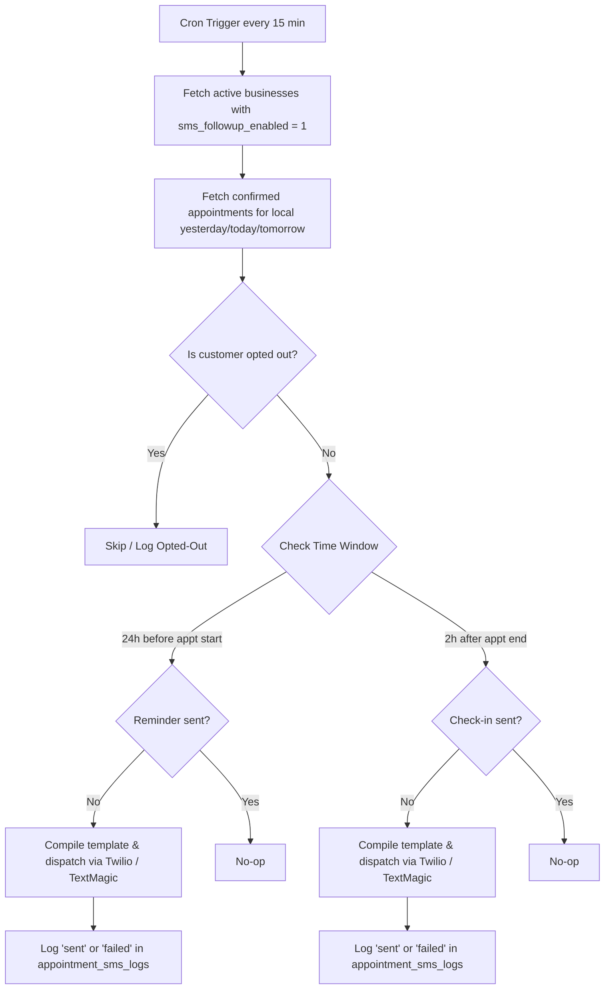

# Technical Specification: Appointment SMS Follow-ups (Feature #5)

This document specifies the design, database schema, trigger logic, message template customization, cron scheduling, and portal integration for the **Appointment SMS Follow-ups** feature on **Branch Live**.

---

## 1. Overview & User Flow

The Appointment SMS Follow-ups feature ensures local service businesses stay top-of-mind with their customers around scheduled service times. By automating reminder texts and post-service follow-ups, the platform minimizes no-shows and converts satisfied check-ins into review opportunities or repeat business.

### Key Value Propositions
* **Reduce No-Shows**: Automatically sends a reminder text 24 hours before the appointment.
* **Quality Assurance & Feedback**: Texts the customer 2 hours after the service to confirm satisfaction and invite feedback.
* **Tone & Brand Consistency**: Enables business owners to customize default templates with placeholders.
* **Carrier Compliance**: Automatically normalizes customer phone numbers to E.164 and appends standard `STOP` opt-out compliance footers.

### User Flow Diagram



---

## 2. Database Schema

All schema changes will be integrated into the existing idempotent `initDB(env)` sequence in `worker.js`.

### 2.1 Schema Migrations

```sql
-- Create tracking table for sent/failed reminders & check-ins
CREATE TABLE IF NOT EXISTS appointment_sms_logs (
  id INTEGER PRIMARY KEY AUTOINCREMENT,
  user_id INTEGER NOT NULL,
  appointment_id INTEGER NOT NULL,
  customer_phone TEXT NOT NULL,
  type TEXT NOT NULL, -- 'reminder' or 'checkin'
  status TEXT NOT NULL, -- 'sent', 'failed', 'opted_out'
  sent_at TEXT, -- datetime('now')
  message_body TEXT NOT NULL,
  error_message TEXT,
  FOREIGN KEY (user_id) REFERENCES users(id),
  FOREIGN KEY (appointment_id) REFERENCES appointments(id)
);

-- Ensure a customer only receives one reminder and one check-in per appointment
CREATE UNIQUE INDEX IF NOT EXISTS idx_appt_sms_uniq ON appointment_sms_logs(appointment_id, type);

-- Index customer phone queries for the lead detail view
CREATE INDEX IF NOT EXISTS idx_appt_sms_phone ON appointment_sms_logs(user_id, customer_phone);

-- Extend settings table with toggles and template fields
-- Note: wrapped in try-catch in initDB() for SQLite compatibility
ALTER TABLE settings ADD COLUMN sms_followup_enabled INTEGER DEFAULT 0;
ALTER TABLE settings ADD COLUMN sms_reminder_template TEXT DEFAULT NULL;
ALTER TABLE settings ADD COLUMN sms_checkin_template TEXT DEFAULT NULL;
```

---

## 3. SMS Template System

### 3.1 Placeholders & Default Templates
Message templates support dynamic variables parsed at dispatch time:
* `{customer_name}`: Customer's first name (extracted from `customer_name` or defaults to "there").
* `{title}`: Appointment name/title.
* `{date}`: Scheduled date (`YYYY-MM-DD`).
* `{time}`: Scheduled start time formatted to the business owner's preference (`12h` or `24h`).
* `{business_name}`: Public name configured in `settings.business_name` (defaults to "us").
* `{business_phone}`: Outbound number configured in `settings.forwarding_number` or `vapi_phone_number`.

#### Default Templates
* **Appointment Reminder (24h before)**:
  `Hi {customer_name}, this is a reminder for your appointment "{title}" tomorrow at {time}.`
* **Post-Appointment Check-in (2h after)**:
  `Hi {customer_name}, thanks for choosing {business_name}! Were you satisfied with our service today? Reply to let us know.`

> [!IMPORTANT]
> The compliance footer `\n\nReply STOP to opt out.` is automatically appended to all dispatched messages regardless of custom templates.

### 3.2 Template Compiler Implementation
Below is the compilation helper to format the templates:

```javascript
function compileAppointmentSms(template, { customerName, title, date, time, businessName, businessPhone }) {
  const firstName = String(customerName || 'there').trim().split(/\s+/)[0] || 'there';
  const body = template
    .replace(/\{customer_name\}/g, firstName)
    .replace(/\{title\}/g, title || 'Appointment')
    .replace(/\{date\}/g, date)
    .replace(/\{time\}/g, time)
    .replace(/\{business_name\}/g, businessName || 'us')
    .replace(/\{business_phone\}/g, businessPhone || '');
  
  return body + "\n\nReply STOP to opt out.";
}
```

---

## 4. Scheduling & Cron Integration

The Cloudflare Worker cron triggers every 15 minutes (`*/15 * * * *`). The appointment follow-up processor runs on every cron invocation to ensure reminders and check-ins are sent precisely.

### 4.1 Timezone-Aware Evaluation
Because appointments are stored in the business's local time, but the worker runs in UTC, the cron evaluates local times dynamically using JavaScript's built-in `Intl.DateTimeFormat`:

```javascript
function getLocalTime(timezone) {
  const tz = timezone || 'America/New_York';
  const parts = new Intl.DateTimeFormat('en-US', {
    timeZone: tz,
    year: 'numeric', month: 'numeric', day: 'numeric',
    hour: 'numeric', minute: 'numeric', second: 'numeric',
    hour12: false
  }).formatToParts(new Date());
  
  const m = {};
  for (const p of parts) {
    m[p.type] = p.value;
  }
  return new Date(`${m.year}-${m.month}-${m.day}T${m.hour.padStart(2, '0')}:${m.minute.padStart(2, '0')}:${m.second.padStart(2, '0')}`);
}
```

### 4.2 Candidate Selection Algorithm
To minimize DB scans, the cron selects confirmed appointments falling within ±2 days of the current UTC date. This safely covers Yesterday, Today, and Tomorrow in all time zones.

```javascript
async function runAppointmentFollowupsCron(env) {
  // 1. Get all active settings
  const { results: activeSettings } = await env.DB.prepare(
    `SELECT user_id, business_name, forwarding_number, timezone, 
            sms_followup_enabled, sms_reminder_template, sms_checkin_template,
            followup_sms_provider
       FROM settings WHERE sms_followup_enabled = 1`
  ).all();
  
  const accounts = activeSettings || [];
  if (!accounts.length) return;

  for (const s of accounts) {
    const uid = s.user_id;
    const tz = s.timezone || 'America/New_York';
    const localNow = getLocalTime(tz);
    
    // Calculate local bounds for Yesterday/Today/Tomorrow
    const localTodayStr = localNow.toISOString().slice(0, 10);
    const yesterday = new Date(localNow.getTime() - 24 * 60 * 60 * 1000).toISOString().slice(0, 10);
    const tomorrow = new Date(localNow.getTime() + 24 * 60 * 60 * 1000).toISOString().slice(0, 10);

    // Fetch active appointments within 3-day local window
    const { results: appointments } = await env.DB.prepare(
      `SELECT * FROM appointments 
        WHERE user_id = ? AND status = 'confirmed' 
          AND date IN (?, ?, ?)`
    ).bind(uid, yesterday, localTodayStr, tomorrow).all();

    for (const appt of appointments || []) {
      const phone = normalizePhone(appt.customer_phone);
      if (!phone) continue;

      // Parse appointment times relative to local timezone
      const apptTime = new Date(`${appt.date}T${appt.time}:00`);
      const apptEnd = new Date(apptTime.getTime() + (appt.duration_min || 60) * 60 * 1000);

      // Check opt-out status
      const optedOut = await isSmsOptedOut(env, uid, phone);
      if (optedOut) {
        // Log opt-out once if not recorded for this appointment
        await logOptedOut(env, uid, appt.id, phone);
        continue;
      }

      // Format time display honoring time format preference
      const timeFmt = await getTimeFormat(env, uid);
      const displayTime = formatHour(appt.time, timeFmt);

      // A. Reminder logic (24h before)
      const hoursToStart = (apptTime.getTime() - localNow.getTime()) / (1000 * 60 * 60);
      if (hoursToStart >= 0.5 && hoursToStart <= 24.5) {
        const sent = await hasSentLog(env, appt.id, 'reminder');
        if (!sent) {
          const tpl = s.sms_reminder_template || 
            `Hi {customer_name}, this is a reminder for your appointment "{title}" tomorrow at {time}.`;
          const msg = compileAppointmentSms(tpl, {
            customerName: appt.customer_name,
            title: appt.title,
            date: appt.date,
            time: displayTime,
            businessName: s.business_name,
            businessPhone: s.forwarding_number
          });
          await dispatchAndLog(env, uid, appt.id, phone, 'reminder', s.followup_sms_provider, msg);
        }
      }

      // B. Check-in logic (2h after)
      const hoursFromEnd = (localNow.getTime() - apptEnd.getTime()) / (1000 * 60 * 60);
      if (hoursFromEnd >= 2.0 && hoursFromEnd <= 6.0) {
        const sent = await hasSentLog(env, appt.id, 'checkin');
        if (!sent) {
          const tpl = s.sms_checkin_template || 
            `Hi {customer_name}, thanks for choosing {business_name}! Were you satisfied with our service today? Reply to let us know.`;
          const msg = compileAppointmentSms(tpl, {
            customerName: appt.customer_name,
            title: appt.title,
            date: appt.date,
            time: displayTime,
            businessName: s.business_name,
            businessPhone: s.forwarding_number
          });
          await dispatchAndLog(env, uid, appt.id, phone, 'checkin', s.followup_sms_provider, msg);
        }
      }
    }
  }
}
```

### 4.3 Database Validation Helpers
```javascript
async function hasSentLog(env, appointmentId, type) {
  const row = await env.DB.prepare(
    "SELECT id FROM appointment_sms_logs WHERE appointment_id = ? AND type = ?"
  ).bind(appointmentId, type).first();
  return !!row;
}

async function dispatchAndLog(env, uid, appointmentId, phone, type, provider, body) {
  const r = await dispatchFollowupSms(env, provider, { to: phone, body });
  if (r.ok) {
    await env.DB.prepare(
      `INSERT INTO appointment_sms_logs (user_id, appointment_id, customer_phone, type, status, sent_at, message_body)
       VALUES (?, ?, ?, ?, 'sent', datetime('now'), ?)`
    ).bind(uid, appointmentId, phone, type, body).run();
  } else {
    await env.DB.prepare(
      `INSERT INTO appointment_sms_logs (user_id, appointment_id, customer_phone, type, status, message_body, error_message)
       VALUES (?, ?, ?, ?, 'failed', ?, ?)`
    ).bind(uid, appointmentId, phone, type, body, String(r.error || 'Unknown error').slice(0, 255)).run();
  }
}
```

---

## 5. Gateway Integration

The follow-up dispatch logic reuses the existing `dispatchFollowupSms(env, provider, { to, body })` helper in [worker.js](file:///C:/Users/17173/Projects/branchlive/worker.js).

* **Twilio**: Executes standard basic auth request using `TWILIO_ACCOUNT_SID` and `TWILIO_AUTH_TOKEN` credentials. Normalizes phone numbers with the existing `normalizePhone(raw)` helper (forces `+1` prefix for NANP formats).
* **TextMagic**: Invokes TextMagic API using the configured `TEXTMAGIC_USERNAME` and `TEXTMAGIC_API_KEY`.

---

## 6. Settings Page UI

The customization panels are integrated into the HTMX-rendered Settings view (`/settings-htmx`).

### 6.1 Settings Panel HTML Markup
Added to `settingsHtmxBody` in [worker.js](file:///C:/Users/17173/Projects/branchlive/worker.js):

```html
<details class="card" style="margin-bottom:20px" open>
  <summary style="cursor:pointer;font-size:1.05rem;font-weight:600">📱 Appointment SMS Follow-ups</summary>
  <p style="color:var(--text-muted);font-size:.9em;margin:12px 0 16px">
    Automatically send text reminders 24h before an appointment, and follow-up check-ins 2h after completion.
  </p>
  
  <div style="margin-bottom:18px">
    <label class="toggle-switch" style="display:flex;align-items:center;gap:10px;cursor:pointer">
      <input type="checkbox" name="sms_followup_enabled" value="1" ${s.sms_followup_enabled ? 'checked' : ''}>
      <span style="font-weight:500">Enable Appointment Reminders & Check-ins</span>
    </label>
  </div>

  ${field('24h Reminder Message Template', `
    <textarea name="sms_reminder_template" rows="3" style="width:100%;box-sizing:border-box;font-size:.85em;font-family:var(--font-mono)">${htmxEsc(s.sms_reminder_template || '')}</textarea>
    <div style="font-size:.78em;color:var(--text-faint);margin-top:6px">
      Placeholders: {customer_name}, {title}, {date}, {time}, {business_name}, {business_phone}
    </div>
  `)}

  ${field('2h Post-Appointment Check-in Template', `
    <textarea name="sms_checkin_template" rows="3" style="width:100%;box-sizing:border-box;font-size:.85em;font-family:var(--font-mono)">${htmxEsc(s.sms_checkin_template || '')}</textarea>
    <div style="font-size:.78em;color:var(--text-faint);margin-top:6px">
      Placeholders: {customer_name}, {title}, {date}, {time}, {business_name}, {business_phone}
    </div>
  `)}
</details>
```

### 6.2 Settings Form Save Update
In `handleSettingsHtmx` inside [worker.js](file:///C:/Users/17173/Projects/branchlive/worker.js), update the `INSERT`/`ON CONFLICT` and `bind` lists:

```javascript
// Add columns to INSERT/UPDATE fields
await env.DB.prepare(
  `INSERT INTO settings (
     ...
     sms_followup_enabled, sms_reminder_template, sms_checkin_template
   ) VALUES (..., ?, ?, ?)
   ON CONFLICT(user_id) DO UPDATE SET
     ...
     sms_followup_enabled = excluded.sms_followup_enabled,
     sms_reminder_template = excluded.sms_reminder_template,
     sms_checkin_template = excluded.sms_checkin_template`
).bind(
  ...
  form.get('sms_followup_enabled') ? 1 : 0,
  g('sms_reminder_template') || null,
  g('sms_checkin_template') || null
).run();
```

---

## 7. Opt-Out Handling

To honor `STOP` keywords, the feature checks the existing centralized table `seasonal_followups` where opt-out state is logged when inbound SMS triggers the webhook.

### 7.1 Webhook Opt-Out Check
The cron candidate logic calls the `isSmsOptedOut` helper before executing any SMS dispatch:

```javascript
async function isSmsOptedOut(env, uid, phone) {
  const normalized = normalizePhone(phone);
  if (!normalized) return true;
  
  const optOutRow = await env.DB.prepare(
    `SELECT id FROM seasonal_followups 
     WHERE user_id = ? AND customer_phone = ? AND status = 'opted_out' 
     LIMIT 1`
  ).bind(uid, normalized).first();
  
  return !!optOutRow;
}
```

### 7.2 Log Opted-Out Action
If a customer phone has opted out, the cron logs the blocked transmission in the logs table:
```javascript
async function logOptedOut(env, uid, appointmentId, phone) {
  const sent = await hasSentLog(env, appointmentId, 'reminder');
  if (!sent) {
    await env.DB.prepare(
      `INSERT INTO appointment_sms_logs (user_id, appointment_id, customer_phone, type, status, sent_at, message_body)
       VALUES (?, ?, ?, 'reminder', 'opted_out', datetime('now'), 'Skipped: customer opted out (STOP)')`
    ).bind(uid, appointmentId, phone).run();
  }
}
```

---

## 8. Portal & Lead Page Integration

The history widget is displayed on the individual lead detail page (`/p/leads/{id}`).

### 8.1 Customer SMS Log Widget
A new rendering helper `renderLeadAppointmentFollowupWidget(env, uid, phone)` displays the record list on the lead profile:

```javascript
async function renderLeadAppointmentFollowupWidget(env, uid, phone) {
  const p = normalizePhone(phone);
  if (!p) return '';

  const { results: logs } = await env.DB.prepare(
    `SELECT l.*, a.title as appt_title, a.date as appt_date 
       FROM appointment_sms_logs l
       JOIN appointments a ON l.appointment_id = a.id
      WHERE l.user_id = ? AND l.customer_phone = ?
      ORDER BY l.id DESC LIMIT 20`
  ).all();

  const listItems = (logs || []).map(h => {
    const typeLabel = h.type === 'reminder' ? '🔔 Reminder' : '💬 Check-in';
    const badgeCls = h.status === 'sent' ? 'badge-booked' : 'badge-new';
    const statusLabel = h.status.toUpperCase();
    
    return `<li style="padding: 8px 0; border-bottom: 1px solid var(--border-soft)">
      <div style="font-size: .82em; color: var(--text-muted); display: flex; justify-content: space-between">
        <span>${typeLabel} — ${htmxEsc(h.appt_title)} (${htmxEsc(h.appt_date)})</span>
        <span class="badge ${badgeCls}">${htmxEsc(statusLabel)}</span>
      </div>
      <div style="font-size: .85em; color: var(--text-primary); margin-top: 4px">${htmxEsc(h.message_body)}</div>
      ${h.error_message ? `<div style="font-size: .78em; color: var(--danger); margin-top: 2px">Error: ${htmxEsc(h.error_message)}</div>` : ''}
    </li>`;
  }).join('');

  return `<div class="card">
    <h3 style="margin-top:0">📱 Appointment SMS Follow-ups</h3>
    ${logs && logs.length 
      ? `<ul style="list-style:none;padding:0;margin:0">${listItems}</ul>` 
      : `<div class="note-box" style="margin:0">No SMS history recorded yet.</div>`
    }
  </div>`;
}
```

### 8.2 Lead Detail Integration
The widget is loaded in `handleLeadDetailHtmx` in [worker.js](file:///C:/Users/17173/Projects/branchlive/worker.js):

```javascript
const appointmentSmsWidget = await renderLeadAppointmentFollowupWidget(env, uid, lead.caller_phone);
```

And inserted into the layout template directly next to the seasonal followup card:

```html
<div style="display:flex;flex-direction:column;gap:20px">
  <div class="card">
    <h3 style="margin-top:0">Contact</h3>
    ...
  </div>
  ${appointmentSmsWidget}
  ${followupWidget}
  ...
</div>
```

---
*No edits were made to worker.js. This specification describes an actionable path to implement the feature.*
